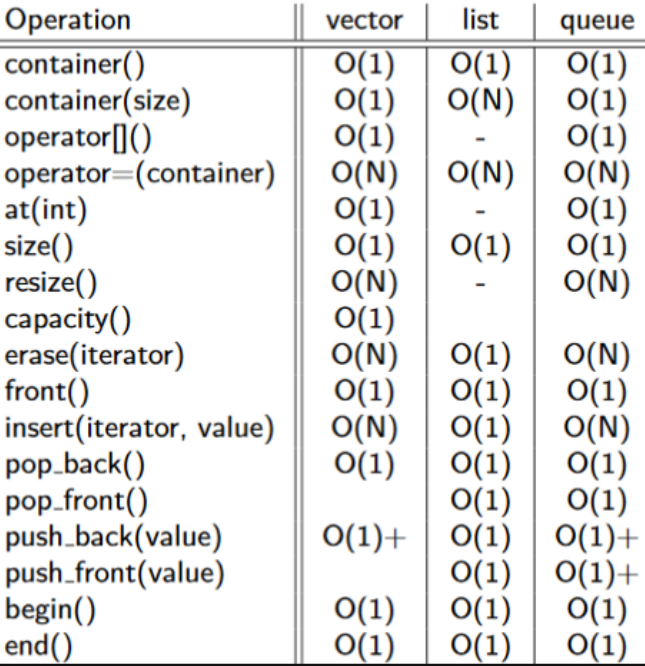
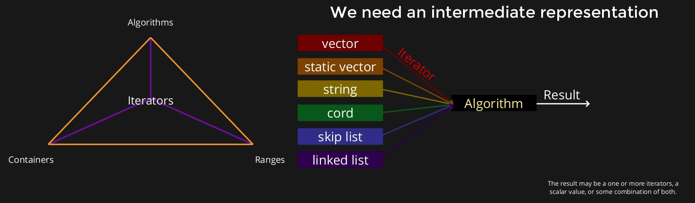
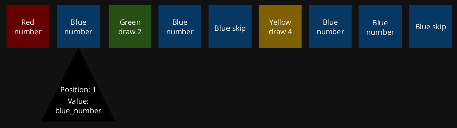
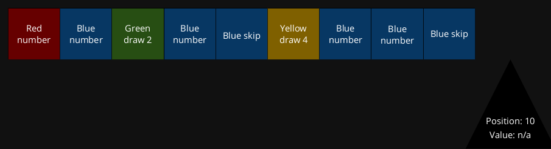
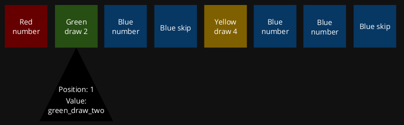
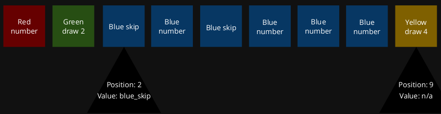

# Libraries

A **library** is a collection of implementations of behaviour, written in terms of a language, that has a well-defined interface by which behaviour is invoked.

Why do we want to use libraries?  
***"Every line of code you don't write is bug free"***

Code in in a popular library is ofter:

* well-documented
* well-tested
* well-reviewed
* has lots of feedback

In COMP6771, we use the following extremely popular libraries

* C++ standard library
* Abseil
* Catch2 (test framework)
* {fmt}
* gsl-lite
* range-v3

## Catch2 Library Recap

``` cpp
#include <catch2/catch.hpp>

TEST_CASE("empty vectors") { // Opens up a context for testing
    auto v = std::vector<int>();

    REQUIRE(v.empty()); // Aborts the test case (not the program) on failure.

    SECTION("check we can insert elements to the back") { // Opens a sub-context, where everything in
        v.push_back(5);                                   // the outer scope runs for *each* SECTION.
        REQUIRE(ranges::distance(v) == 1);

        CHECK(v[0] == 1); // Gives a meaningful message on failure, but doesn't abort.
        CHECK(v.back() == v[0]);

        SECTION("check we can insert elements to the front") {
            auto const result = v.insert(v.begin(), -1);
            REQUIRE(ranges::distance(v) == 2);
            CHECK(result == v.begin());
            CHECK(v[0] == -1);
            CHECK(v.front() == v[0]);

            CHECK(v[1] == 0);
            CHECK(v.back() == v[1]);
        }

        SECTION("check we can remove elements from the back") {
            v.pop_back();
            CHECK(v.empty()); // remember that each section inherits an independent context from its parent scope
        }
    }
}
```

## Containers

Containers are abstractions of common data structures. They are objects that you can "put"other objects "into".

Container operations vary in time and space complexity. Their performance has a basis in physics (see [here](TODO)).

`std::vector` is always the default container (see [here](TODO))

The complexity of common container operations:



### Sequence Containers

**Sequence containers** organise a finite set of objects into a strict **linear** arrangement.

| Container           | Arrangement             |
| ---                 | ---                     |
| `std::vector`       | Dynamically-sized array |
| `std::array`        | Fixed-sized array       |
| `std::deque`        | Double-ended queue      |
| `std::forward_list` | Singly-linked list      |
| `std::std::list`    | Doubly-linked list      |

### Unordered Associative Containers

**Unordered associative containers** provide **fast** retrieval of data based on keys. The keys are **hashed**.

| Container             | Arrangement                                       |
| ---                   | ---                                               |
| `std::unordered_set`  | A collection of unique keys                       |
| `absl::flat_hash_set` | A collection of unique keys                       |
| `std::unordered_map`  | Associative array that map unique keys to a value |
| `absl::flat_hash_map` | Associative array that map unique keys to a value |

The Abseil flat-hash containers offer significant performance benefits over the `std::` containers. They are interface-compatible.

### Associative Containers

**Associative containers** provide **fast** retrieval of data based on keys. The keys are **sorted**.

| Container       | Arrangement                                            |
| ---             | ---                                                    |
| `std::set`      | A collection of unique keys                            |
| `std:multiset`  | A collection of keys                                   |
| `std::map`      | Associative array that map unique keys to a values     |
| `set::multimap` | Associative array where one key may map to many values |

These containers are mostly interface-compatible with unordered associative containers.

## String Processing

### User-defined Literals

Normally when we initialise a string we use:

``` cpp
auto const greeting = std::string("hello, world");
```

**User-defined literals** (UDLs) can remove the need to write `std::string` all the time:

``` cpp
using namespace std::string_literals;
auto const greeting = "hello, world"s;
```

We should put `using`-directives in the smallest scope possible

``` cpp
#include <string>

auto main() -> int {
    using namespace std::string_literals;
    auto const greeting = "hello, world"s;
}
```

### String Concatenation

``` cpp
#include <absl/strings/str_cat.h>
#include <string>

auto const greeting = absl:StrCat("hello", "world", "!");
```

### String Formatting

``` cpp
#include <fmt/format.h>
#include <iostream>
#include <string>

auto const message1 = fmt::format("The meaning of life is {}", 42);
std::cout << message1 << '\n';

auto const message1 = fmt::format("pi has the value {}", 3.1415);
std::cout << message1 << '\n';

auto const message3 = fmt::format("life={}, pi={}", 42, 3.1415);
std::cout << message3 << '\n';

auto const message4 = fmt::format("life={life}, pi={pi}",
                                  fmt::arg("pi", 3.1415),
                                  fmt::arg("life", 42));
```

## `std::vector` Revisited

### Initialising Vectors

``` cpp
auto some_ints = std::vector<int>{0, 1, 2, 3, 2, 5};
REQUIRE(ranges::distance(some_ints) == 6);

// Querying a vector
CHECK(some_ints[0] == 0);
CHECK(some_ints[1] == 1);
CHECK(some_ints[2] == 2);
CHECK(some_ints[3] == 3);
CHECK(some_ints[4] == 2);
CHECK(some_ints[5] == 5);
```

### Adding Elements To a Vector

`std::vector` grows as we add elements

``` cpp
auto some_ints = std::vector<int>{0, 1, 2, 3, 2, 5};
REQUIRE(ranges::distance(some_ints) == 6);

some_ints.push_back(42);
REQUIRE(ranges::distance(some_ints) == 7);

CHECK(some_ints[6] == 42);
```

### Removing Elements From a Vector

`std::vector` shrinks as we remove elements

``` cpp
auto some_ints = std::vector<int>{0, 1, 2, 3, 2, 5};
REQUIRE(ranges::distance(some_ints) == 6);

some_ints.pop_back();
REQUIRE(ranges::distance(some_ints) == 5);
CHECK(some_ints.back() == 2);

// erase any occurrence of 2
std::erase(some_ints, 2);
REQUIRE(ranges::distance(some_ints) == 4);
CHECK(some_ints[2] == 3);
```

``` cpp
auto some_ints = std::vector<int>{0, 1, 2, 3, 2, 5};
REQUIRE(ranges::distance(some_ints) == 6);

some_ints.clear(); // removes *all* elements
CHECK(some_ints.empty());

auto const no_elements = std::vector<int>{};
REQUIRE(no_elements.empty());

CHECK(some_elements == no_elements);
```

### More Vector Initialisation

I want a vector with five zeros

``` cpp
auto all_default = std::vector<double>(5);
REQUIRE(ranges::distance(all_default) == 5);

CHECK(all_default[0] == 0.0);
CHECK(all_default[1] == 0.0);
CHECK(all_default[2] == 0.0);
CHECK(all_default[3] == 0.0);
CHECK(all_default[4] == 0.0);
```

I want a vector with three identical values

``` cpp
auto const initial_value = std::string("some words go here!");
auto all_same = std::vector<std::string>(3, intial_value);
REQUIRE(ranges::distance(all_same) == 3);

CHECK(all_same[0] == initial_value);
CHECK(all_same[1] == initial_value);
CHECK(all_same[2] == initial_value);

all_same[1] = "other words";
CHECK(all_same[0] != all_same[1]);
CHECK(all_same.front() == all_same.back());
```

## Stacks and Queues

``` cpp
enum class colour { red, green, blue, yellow };
enum class value { number, draw_two, draw_four, reverse, skip };

struct car {
    colour colour;
    value value;

    friend auto operator==(card, card) -> bool = default;
};

auto const red_number = card{colour::red, value::number};
auto const blue_number = card{colour::blue, value::number};
auto const green_draw_two = card{colour::green, value::draw_two};
auto const blue_skip = card{colour::blue, value::skip};
auto const yellow_draw_four = card{colour::yellow, value::draw_four};
```

### Stacks

**Stacks** and their functions can be accessed using `#include <stack>`

#### Initialising and Adding Elements To a Stack

``` cpp
auto deck = std::stack<card>();
REQUIRE(deck.empty());

deck.push(red_number);
deck.push(green_draw_two);
deck.push(green_draw_two);
deck.push(yellow_draw_four);
deck.push(blue_number);
```

#### Removing Elements From a Stack

``` cpp
CHECK(deck.top() == blue_number); // access top element
deck.pop();                       // remove top element

CHECK(deck.top() == yellow_draw_four);
deck.pop();
```

#### Comparing Two Stacks

``` cpp
auto const more_cards = deck;
REQURE(more_cards == deck);

deck.pop();
CHECK(more_cards != deck);
```

### Queues

**Queues** and their functions can be accessed by using `#include <queue>`

#### Initialising and Adding Element To a Queue

``` cpp
auto deck = std::queue<card>();
REQUIRE(deck.empty());

deck.push(red_number);
deck.push(green_draw_two);
deck.push(green_draw_two);
deck.push(yellow_draw_four);
deck.push(blue_number);
```

#### Removing Elements From a Queue

``` cpp
CHECK(deck.front() == red_number); // access first element
deck.pop();                        // remove first element

CHECK(deck.front() == green_draw_two);
deck.pop();
```

#### Comparing Two Queues

``` cpp
auto const more_cards = deck;
REQURE(more_cards == deck);

deck.pop();
CHECK(more_cards != deck);
```

## Iterators

> A range is an ordered sequence of elements with a designated start and rule for finishing

**Iterators** are a common theme between containers, algorithms and ranges. They provide and intermediate representation for which containers an be used by algorithms.



Algorithms go through containers using iterators and return an iterator as a result.

Comparing iterators with other traversal methods:

| Operation      | Array-like                  | Node-based     | Iterator      |
| ---            | ---                         | ---            | ---           |
| Iteration type | `gsl_lite::index`           | `node*`        | `unspecified` |
| Read element   | `v[i]`                      | `i->value`     | `*i`          |
| Successor      | `j = i + n < ranges::distance(v) ? i + n : ranges::distance(v)` | `j = i->successor(n)` | `ranges::next(i, s, n')` |
| Predecessor    | `j = i - n < 0 ? 0 : i - n` | `j = i->precessor(n)` | `ranges::prev(i, s, n)` |
| Advance fwd    | `++i`                       | `i = i->next`  | `++i`         |
| Advance bwd    | `--i`                       | `i = i->prev`  | `--i`         |
| Comparison     | `i < ranges::distance(v)`   | `i != nullptr` | `i != s`      |

Note: `++i` is preferred over `i++`

### Ranges

`libc++` doesn't support ranges yet, which is why we're using `range-v3` instead of standard ranges. For the purposes of the course, `range-v3` and standard ranges are almost 1:1 in nature.  
A guide to including range functions:

``` cpp
#include <range/v3/algorithm.hpp> // for algorithms
#include <range/v3/iterator.hpp>  // for iterator-related stuff
#include <range/v3/range.hpp>     // for ranges::distance and ranges::to
#include <range/v3/view.hpp>      // for views (in standard C++ they live in <ranges>)

// You can include specific algorithms and views
#include <range/v3/algorithm/equal_range.hpp>
#include <range/v3/view/filter.hpp>
```

Note:

* prefer `std::span` to `ranges::span` and `std::exchange` to `ranges::exchange`
* `ranges::begin`, `ranges::end`, etc., are preferred over `std::begin`, `std::end`, etc. see [here](TODO)
* `ranges::swap` is preferred over `std::swap` for similar reasons to `ranges::begin`.

Generating a hand of cards

``` cpp
auto hand = std::vector<card>{
    red_number,
    blue_number,
    green_draw_two,
    blue_number,
    blue_skip,
    yellow_draw_four,
    blue_number,
    blue_number,
    blue_skip,
};
```

#### Counting Cards

``` cpp
#include <range/v3/algorithm.hpp>

CHECK(ranges::count(hand, red_number) == 1);
CHECK(ranges::count(hand, blue_number) == 4);
CHECK(ranges::count(hand, blue_skip) == 2);
```

#### Finding a Card

``` cpp
#include <range/v3/algorithm.hpp>

auto card_to_play = ranges::find(hand, blue_number);
REQUIRE(card_to_play != hand.end());
CHECK(*card_to_play == blue_number);
```

`card_to_play` is an iterator at position `1` with value `blue_number`



``` cpp
#include <range/v3/algorithm.hpp>

auto const green_draw_four = card{colour::green, value::draw_four};
auto card_to_play = ranges::find(hand, green_draw_four);

REQUIRE(card_to_play == hand.cend());
```

`card_to_play` is an iterator at position `10` with no value since the card can't be fount



#### Erasing a Single Specific Card

``` cpp
#include <range/v3/algorithm.hpp>

auto card_to_play = ranges::find(hand, blue_number);
REQUIRE(card_to_play != hand.cend());
CHECK(*card_to_play == blue_number);

card_to_play = hand.erase(card_to_play);
REQUIRE(card_to_play != hand.cend());
CHECK(*card_to_play = green_draw_two);
```

`card_to_play` is an iterator at position `1` and value `green_draw_two` since `erase()` returns the iterator following the last removed element



#### Getting a Range of Values

``` cpp
#include <range/v3/algorithm.hpp>

ranges::sort(hand);
REQUIRE(ranges::is_sorted(hand));

auto [first, last] = ranges::equal_range(hand, blue_number);
REQUIRE(first != last);
CHECK(ranges::distance(first, last) == 4);

CHECK(ranges::all_of(first, last, [blue_number](card const x) {  // uses lambda expressions
    return x == blue_number;
}));
```

`ranges::equal_range` returns iterators of the beginning and end that match the given value  
See more on lambda expressions [here](#lambda-expressions)



#### Lambda Expressions

**Lambda expressions** (or **anonymous functions**) are function definitions that are not bound to an identifier. They are often passed as arguments to higher-order functions, or used to construct the result of a higher order function that needs to return a function.

``` cpp
#include <range/v3/algorithm.hpp>

// count_if counts the number of elements that satisfy a given predicate
auto const blue_cards = ranges::count_if(hand, [](card const c) {
    return c.colour = colour::blue
});

auto const expected_blue_cards = 6;
CHECK(blue_cards == expected blue_cards)
```

Lambda unary predicate:

``` cpp
[](card const c) {
    return c.colour == colour::blue;
}
```

Explicit return type:

``` cpp
[](card const c) -> bool {
    return c.colour == colour::blue;
}
```

Multi-argument lambda:

``` cpp
auto const blue_then_yellow = [](card const x, card const y) {
    return x.colour == colour::blue and y.colour == colour::yellow;
};

auto const blue_card = ranges::adjacent_find(hand, blue_then_yellow);
REQUIRE(blue_card != hand.end());
CHECK(*blue_card == blue_skip);

auto const yellow_card = ranges::next(blue_card);
CHECK(*yellow_card == yellow_draw_four);
```

##### Lambda with value capture

Lambda allows **captures**, which is a list that defines ***outside variables*** that are accessible from within the lambda function body.

``` cpp
[blue_number](card const x) {
    return x == blue_number;
}
```

We can capture by **reference**:

``` cpp
[&cards_swapped](card const c) {
    // ... stuff
}

```

We **capture by value** when:

* the variable may change, and we want the variable at the current time

We **capture by reference** when:

* the lifetime of the lambda may exceed the lifetime of the value
* the variable may change and we want it to stay updated
* the variable is unable to be copied, or expensive to be copied

Example: two  players can swap a card of the same value (but for a different colour)

``` cpp
#include <range/v3/algorithm.hpp>

auto note_swaps(std::map<card, int>& cards_swapped, card const c) -> void {
    auto result = cards_swapped.find(c);
    if (result == cards_swapped.end()) {
        cards_swapped.emplace(c, 1);
        return;
    }

    ++(result->second);
}

{
    auto cards_swapped = std::map<card, int>{};
    ranges::transform(hand, hand.begin(), [&cards_swapped](card const c) {
        if (c.colour != colour::blue) {
            return c;
        }

        note_swaps(cards_swapped, c);
        return card{colour::green, c.value};
    });

    CHECK(ranges::none_of(hand, [](card const c) {
        return c.colour == colour::blue;
    }));
}
{
    REQUIRE(cards_swapped.contains(blue_number));
    CHECK(cards_swapped.at(blue_number) == 4);
    auto const green_number = card{colour::green, value::number};
    CHECK(ranges::count(hand, green_number) == 4);
}
{
    REQUIRE(cards_swapped.contains(blue_skip));
    CHECK(cards_swapped.at(blue_skip) == 2);
    auto const green_skip = card{colour::green, value::skip};
    CHECK(ranges::count(hand, green_skip) == 2);
}
```

##### Lambda and Library Function Objects

``` cpp
#include <range/v3/functional.hpp>

ranges::equal{}
// is roughly equivalent to
[](auto const& x, auto const& y) {
    return x == y;
}
```

``` cpp
#include <range/v3/functional.hpp>

ranges::not_equal_to{}
// is roughly equivalent to
[](auto const& x, auto const& y) {
    return x != y;
}
```

``` cpp
#include <range/v3/functional.hpp>

ranges::plus{}
// is roughly equivalent to
[](auto const& x, auto const& y) {
    return x + y;
}
```

``` cpp
#include <range/v3/functional.hpp>

ranges::multiplies{}
// is roughly equivalent to
[](auto const& x, auto const& y) {
    return x * y;
}
```

#### Container Size

We usually want to use `ranges::distance` to get the size of a container because its return type is implicitly compatible with `int`.

The vector/string interfaces use a different type with different characteristics, and we don't want to mix them up. The compiler helps us with this.

You can use `size()` for those parts of the interface, if you keep the scopes small.

``` cpp
#include <<range/v3/range.hpp> // for ranges::distance
// E.g. 1
auto v = std::vector<int>(other.size());

// E.g. 2 (yuck, but best option till you get more experience)
for (auto i = 0; i < ranges::distance(v); ++i) {
    using size_type = std::vector<int>::size_type; // C++ typedef
    v[gsl_lite::narrow_cast<size_type>(i)];
}

// E.g. 3 i should not leave the scope of the loop
for (auto i = std::vector<int>::size_type{0}; i < v.size(); ++i) {
    v[i];
}
```

#### Constructing a Vector of One Type From a Vector of Another type

``` cpp
auto standard_deviation_distribution() -> std::vector<double>;
static_cast<std::vector<int>>(standard_deviation_distribution());
// gives us a compile-time error: we can't construct vector<int> from a vector<double>

auto standard_deviation_distribution() -> std::vector<double>;
auto const intermediate = standard_deviation_distribution();
std::vector<int>(intermediate.begin(), intermediate.end());
```

#### Generating a Sequence of Values on Demand

Say we want to create a vector with values with a large sequence of integers.  
We could manually declare the values:

``` cpp
auto const first_ten_thousand = std::vector<int>{
    0, 1, 2, /* ... */, 999,
}
```

Or, we could have them get generated for us:

``` cpp
#include <range/v3/numeric.hpp>

auto first ten_thousand = std::vector<int>(10000);

// populates vector with values [0, ..., 9999]
ranges::iota(first_ten_thousand, 0);
```

``` cpp
#include <range/v3/range.hpp>
#include <range/v3/view.hpp>

auto first_hundred = views::iota(0, 100); // creates a range of values 0 .. 99
// convert range of values to a vector
auto const all_at_once= first_hundred | ranges::to<std::vector>;

CHECK(ranges::equal(first_hundred, all_at_once));
// We can compare values without needing them to be the same type
// ranges::equal converts them to ranges and compares them
```

The `|` is just like in UNIX; it pipe values.

#### Filters

Filters ("keep if"):

``` cpp
#include <range/v3/range.hpp>
#include <range/v3/view.hpp>
namespace views = ranges::views;

auto is_blue = [](card const c) { return c.colour == colour::blue; };
auto all_blue = hand | views::filter(is_blue);

auto const expected = std::vector<card>{
    blue_number,
    blue_number,
    blue_skip,
    blue_number,
    blue_number,
    blue_skip,
};

auto const actual = all_blue | ranges::to<std::vector>;
CHECK(expected == actual);
```

Filters ("remove if"):

``` cpp
#include <range/v3/range.hpp>
#include <range/v3/view.hpp>
namespace views = ranges::views;

auto is_blue = [](card const c) { return c.colour == colour::blue; };
auto no_blue = hand | views::remove_if(is_blue);

auto const expected = std::vector<card>{
    red_number,
    green_draw_two,
    yellow_draw_four,
};

auto const actual = no_blue | ranges::to<std::vector>;
CHECK(expected == actual);
```

#### Reversing

``` cpp
#include <range/v3/range.hpp>
#include <range/v3/view.hpp>
namespace views = ranges::views;

auto const is_blue_card = [](card const c) { return c.colour == colour::blue; };
{
    // find the first blue card
    auto const result = ranges::find_if(hand, is_blue_card);
    REQUIRE(result != hand.end());
    CHECK(*result == blue_number);
}
{
    // find the last blue card
    auto back_to_front = hand | views::reverse;

    auto const result = ranges::find_if(back_to_front, is_blue_card);
    REQUIRE(result != back_to_front.end())
    CHECK(*result == blue_skip);
}
```

#### In-place Transform

``` cpp
#include <range/v3/range.hpp>
#include <range/v3/view.hpp>
namespace views = ranges::views;

auto swap_blue = [](card const c) {
    return c.colour != colour::blue ? c : card{colour::green, c.value};
};

auto const expected = std::vector<card>{
    red_number,
    green_number,
    green_draw_two,
    green_number,
    green_skip,
    yellow_draw_four,
    green_number,
    green_number,
    green_skip,
};

auto const actual = hand | views::transform(swap_blue);
CHECK(expected == actual);
```

#### More String Manipulation

Splitting strings:

``` cpp
#include <range/v3/range.hpp>
#include <range/v3/view.hpp>
namespace views = ranges::views;
using namespace std::string_literals;

auto const sentence = "the quick brown fox jumps over the lazy dog"s;
auto to_string = [](auto x) { return x | ranges::to<std::string>; };
auto const individual_words = sentence
                            | views::split(' ')
                            | views::transform(to_string)
                            | ranges::to<std::vector>;

auto const expected = std::vector<std::string>{
    "the", "quick", "brown", "fox", "jumps", "over", "the", "lazy", "dog"
};

CHECK(individual_words == expected);
```

Joining strings:

``` cpp
#include <range/v3/range.hpp>
#include <range/v3/view.hpp>
namespace views = ranges::views;

auto const individual_words = std::vector<std::string>{
    "the", "quick", "brown", "fox", "jumps", "over", "the", "lazy", "dog"
};

auto const sentence = words | views::join(' ') | ranges::to<std::string>;

using namespace std::string_literals;
auto const expected = "the quick brown fox jumps over the lazy dog"s;
CHECK(sentence == expected);
```

Concatenating ranges:

``` cpp
#include <range/v3/range.hpp>
#include <range/v3/view.hpp>
namespace views = ranges::views;
using namespace std::string_literals;

auto const first = "the quick brown "s;
auto const second = "fox jumps over"s;
auto const third = std::vector<std::string>{" the", "lazy", "dog"};

auto const sentence = views::concat(first, second, third | views::join(' '))
                    | ranges::to<std::string>;

auto const expected = "the quick brown fox jumps over the lazy dog"s;
CHECK(sentence == expected);
```

#### First/Last *n* Elements

Using ***only*** the first *n* elements:

``` cpp
#include <range/v3/range.hpp>
#include <range/v3/view.hpp>
namespace views = ranges::views;

auto const front3 = hand | views::take(3) | ranges::to<std::vector>;
auto const expeceted std::vector<card>{
    red_number,
    blue_number,
    green_draw_two,
};
CHECK(front3 == expected);
```

Use ***all but*** the first *n* elements

``` cpp
#include <range/v3/range.hpp>
#include <range/v3/view.hpp>
namespace views = ranges::views;

auto const back6 = hand | views::drop(3) | ranges::to<std::vector>;
auto const expeceted std::vector<card>{
    blue_skip,
    yellow_draw_four,
    blue_number,
    blue_number,
    blue_skip,
};
CHECK(back6 == expected);
```

Use ***only*** the last *n* elements:

``` cpp
#include <range/v3/range.hpp>
#include <range/v3/view.hpp>
namespace views = ranges::views;

auto const back2 = hand | views::take_last(2) | ranges::to<std::vector>;
auto const expeceted std::vector<card>{
    blue_number,
    blue_skip,
};
CHECK(back2 == expected);
```

***Don't*** use the last *n* elements:

``` cpp
#include <range/v3/range.hpp>
#include <range/v3/view.hpp>
namespace views = ranges::views;

auto const front6 = hand | views::drop_last(3) | ranges::to<std::vector>;
auto const expeceted std::vector<card>{
    red_number,
    blue_number,
    green_draw_two,
    blue_number,
    blue_skip,
    yellow_draw_four,
    blue_number,
};
CHECK(front6 == expected);
```

#### Iterating Over Multiple Ranges

``` cpp
#include <range/v3/numeric.hpp>
#include <range/v3/range.hpp>
#include <range/v3/view.hpp>
namespace views = ranges::views;

auto hamming_distance(std::string const& s1, std::string const& s2) -> int {
    auto different = views::zip_with(ranges::not_equal_to{}, s1, s2);
    return ranges::accumulate(different, 0);
}

CHECK(hamming_distance("chew", "chop") == 2);
CHECK(hamming_distance("hello", "world") == 4);
```

#### Inserting into Iterators

Populating an existing vector with a single value:

``` cpp
auto rest_scores(std::vector<int>& scores) -> void {
    ranges::fill(scores, 0);
}
```

Copying values from one range to another existing range:

``` cpp
auto chars_to_words(std::vector<char> const& from, std::string& to) {
    return ranges::copy(from, to.begin());
}
```

We **will** have an **overflow problem** if `ranges::distance(from) > ranges::distance(to)`. E.g. `from` is `"Hello there"` and `to` is of size `5`
To solve this, use `ranges::back_inserter()`

``` cpp
#include <range/v3/iterator.hpp>

auto to = std::vector<char>();
REQUIRE(to.empty());

ranges::copy(from, ranges::back_inserter(to)); // works on containers with a push_back member like vector's
CHECK(to == expected)
```

Alternative we can use `assign()`:

``` cpp
auto to = std::vector<char>(5);
REQUIRE(ranges::distance(from) > ranges::distance(to));
REQUIRE(not to.empty());

to.assign(from.begin(), from.end());
CHECK(to == expected);
```

Some insert iterators:

| Function                 | What does it do?                                                                     |
| ---                      | ---                                                                                  |
| `ranges::back_inserter`  | Works on containers that have `push_back` (e.g. `std::vector`, `std::string`)        |
| `ranges::front_inserter` | Works on containers that have `push_front` (e.g. `std::deque`, `std::list`)          |
| `ranges::inserter`       | Works on containers that have insert (e.g. all the above, `absl::flat_hash_set/map`) |

Say we want to insert a vector in the middle of another vector. We can do so as follows...

``` cpp
auto some_numbers = views::concat(views::iota(0, 50), views::iota(75, 100))
                  | ranges::to<std::vector>;

auto square = [](int const x) { return x * x; };
auto more_numbers = views::iota(50, 75)
                  | views::transform(square)
                  | ranges::to<std::vector>;

auto non_uniform_gap = ranges::adjacent_find(some_numbers,
    [](int const x, int const y) { return y - x != 1; });
some_numbers.insert(non_uniform_gap, more_numbers.begin(), more_numbers.end());
```

... but we didn't really need two vectors, since `more_numbers` is already an iterator

``` cpp
auto some_numbers = views::concat(views::iota(0, 50), views::iota(75, 100))
                  | ranges::to<std::vector>;

auto square = [](int const x) { return x * x; };
auto more_numbers = views::iota(50, 75)
                  | views::transform(square)
                  | views::common;

// views::common will adapt the previous slide's more_numbers'
// begin and end into a type that has a _common_ begin and end
// type (hence the name views::common).
auto non_uniform_gap = ranges::adjacent_find(some_numbers,
    [](int const x, int const y) { return y - x != 1; });
some_numbers.insert(non_uniform_gap, more_numbers.begin(), more_numbers.end());
```

#### Mutable Iterators

Mutable iterators are iterators with both a read and write operation.

In the code snippet below, we want to copy the values of `from` to `to`.  
Notice that `i` if modifiable when we don't want it to be:

``` cpp
auto from = std::vector<int>(10);
auto to = std::vector<int>(10);

// ...

// We would use ranges::copy IRL
for (auto i = from.begin(), j = to.begin(); i != from.end() and j != to.end(); ++i, ++j)
{
    *i = *j;
}
```

We have `const_iterator` which make the iterator read-only:

``` cpp
// mutable iterator       (similar to `T&`, where T is any type)
std::vector<T>::iterator

// read-only iterator     (similar to `T const&`, where T is any type)
std::vector<T>::const_iterator
```

To fix our problem before:

``` cpp
auto from = std::vector<int>(10);
auto to = std::vector<int>(10);

// ...

// We would use ranges::copy IRL
for (auto i = from.cbegin(), j = to.begin(); i != from.cend() and j != to.end(); ++i, ++j)
    *i = *j; // compile-time error: can't write to a const_iterator
}
```
