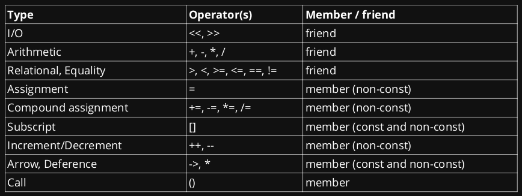

# Operator Overloading

We can overload operators and specify how we want them to behave.  
It allows us to use currently understood semantics (all of the operators) and gives us a common and simple interface to define class methods.

``` cpp
#include <iostream>
class point {
public:
    point(int x, int y)
    : x_{x}
    , y_{y} {};

    friend point operator+(point const& lhs, point const& rhs) {
        return point(lhs.x_ + rhs.x_, lhs.y_ + rhs.y_);
    }
    friend std::ostream& operator<<(std::ostream& os, point const& p) {
        os << "(" << p.x_ << "," << p.y_ << ")";
        return os;
    }

private:
    int x_;
    int y_;
};

auto main() -> int {
    point p1{1, 2};
    point p2{2, 3};
    std::cout << p1 + p2 << "\n";
}
```

## Friend

A class may declare `friend` functions or classes.

Those functions/classes are non-member functions that may access private parts of the class.  
This is, in general, a ***bad idea***, but there are a few cases where it may be required:

* Non-member operator overloads
* Related classes:
    * A `Window` class might have `WindowManager` as a friend
    * A `TreeNode` class might have a `Tree` as a friend
    * Container could have `iterator_t<Container>` as a friend - though a nested class may be more appropriate

Use friends when:

* The data should not be available to everyone
* There is a piece of code very related to this particular class.

***In general, we prefer to define friends directly in the class they relate to.***

## Operator Overloads

C++ supports a rich set of operator overloads.

All operator overloads must have at least one operant of its type.

Advantages:

* Reuse existing code semantics
* No verbosity required for simple operations

Disadvantages:

* Lack of context on operations

**Only create an overload if you type has a single, obvious meaning to an operator**.

Operator overload design:



Use members when the operation is called in the context of a particular instance  
Use friends when the operation is called without any particular instance (even if they don't require access to private details)

For more operator overloads see [here](https://en.cppreference.com/w/cpp/language/operators)

### Overload: I/O

This is equivalent to `.toString()` method in Java  
Scope to overload for different types of output and input streams

``` cpp
#include <istream>
#include <ostream>
class point {
public:
    point(int x, int y)
    : x_{x}
    , y_{y} {};
    friend std::ostream& operator<<(std::ostream& os, const point& type) {
        os << "(" << p.x_ << "," << p.y_ << ")";
        return os;
    }
    friend std::istream& operator>>(std::istream& is, point& type) {
        // To be done in tutorials
    }
private:
    int x_;
    int y_;
};

auto main() -> int {
    point p(1, 2);
    std::cout << p << '\n';
}
```

### Operator Pairings

Many operators should be grouped together. This table should help you work out which are minimal set of operators to overload for any particular operator.

| If you overload      | Then you should also overload                     |
| ---                  | ---                                               |
| `operator OP=(T, U)` | `operator OP(T, U)`                               |
| `operator+(T, U)`    | `operator+(U, T)`                                 |
| `operator-(T, U)`    | `operator+(T, U)`, `operator+(T)`, `operator-(T)` |
| `operator/(T, U)`    | `operator*(T, U)`                                 |
| `operator%(T, U)`    | `operator/(T, U)`                                 |
| `operator++()`       | `operator++(int)`                                 |
| `operator--()`       | `operator++()`, `operator--(int)`                 |
| `operator->()`       | `operator*()`                                     |
| `operator+(T)`       | `operator-(T)`                                    |

### Overload: Compound Assignment

Sometimes particular methods might not have any real meaning, and they should be omitted (in this case, what does dividing two points together mean).

Each class can have any number of `operator+=` operators, but there can only be one `operator+=(X)` where X is a type.  That's why in this case we have two multiplier compound assignment operators

``` cpp
class point {
public:
    point(int x, int y)
    : x_{x}
    , y_{y} {};

    point& operator+=(point const& p) {
        x_ += p.x_;
        y_ += p.y_;
        return *this;
    }
    point& operator-=(point const& p) { /* what do we put here? */}
    point& operator*=(point const& p) { /* what do we put here? */}
    point& operator/=(point const& p) { /* what do we put here? */}
    point& operator*=(int i) { /* what do we put here? */}

private:
    int x_;
    int y_;
};
```

### Overload: Relational Equality

``` cpp
#include <iostream>
class point {
public:
    point(int x, int y)
    : x_{x}
    , y_{y} {}

    // hidden friend - preferred
    friend bool operator==(point const& p1, point const& p2) {
        return p1.x_ == p2.x_ and p1.y_ == p2.y_;
        // return std::tie(p1.x_, p1.y_) == std::tie(p2.x_, p2.y_);
    }
    friend bool operator!=(point const& p1, point const& p2) {
        return not (p1 == p2);
    }
    friend bool operator<(point const& p1, point const& p2) {
        return p1.x_ < p2.x_ && p1.y_ < p2.y_;
    }
    friend bool operator>(point const& p1, point const& p2) {
        return p2 < p1;
    }
    friend bool operator<=(point const& p1, point const& p2) {
        return not (p2 < p1);
    }
    friend bool operator>=(point const& p1, point const& p2) {
        return not (p1 < p2);
    }
private:
    int x_;
    int y_;
};

auto main() -> int {
    auto const p2 = point{1, 2};
    auto const p1 = point{1, 2};
    std::cout << "p1 == p2 " << (p1 == p2) << '\n';
    std::cout << "p1 != p2 " << (p1 != p2) << '\n';
    std::cout << "p1 < p2 " << (p1 < p2) << '\n';
    std::cout << "p1 > p2 " << (p1 > p2) << '\n';
    std::cout << "p1 <= p2 " << (p1 <= p2) << '\n';
    std::cout << "p1 >= p2 " << (p1 >= p2) << '\n';
}
```

Do we want all of these?  
We're able to "piggyback" off previous definitions.  
This is where the spaceship operator is useful

### Overload: Spaceship Operator

``` cpp
#include <compare>
#include <iostream>

class point {
public:
    point(int x, int y)
    : x_{x}
    , y_{y} {};

    // hidden friend - preferred
    // return type deduced as std::strong_ordering
    friend auto operator<=>(point p1, point p2) = default;
private:
    int x_;
    int y_;
};

auto main() -> int {
    auto const p2 = point{1, 2};
    auto const p1 = point{1, 2};
    std::cout << "p1 == p2 " << (p1 == p2) << '\n';
    std::cout << "p1 != p2 " << (p1 != p2) << '\n';
    std::cout << "p1 < p2 " << (p1 < p2) << '\n';
    std::cout << "p1 > p2 " << (p1 > p2) << '\n';
    std::cout << "p1 <= p2 " << (p1 <= p2) << '\n';
    std::cout << "p1 >= p2 " << (p1 >= p2) << '\n';
}
```

``` cpp
#include <compare>
#include <iostream>

class point {
public:
    point(int x, int y)
    : x_{x}
    , y_{y} {};

    // hidden friend - preferred
    // return type deduced as std::partial_ordering
    friend auto operator<=>(point p1, point p2) = default;
private:
    double x_;
    double y_;
};
auto main() -> int {
    auto const p2 = point{1.0, 2.0};
    auto const p1 = point{1.0, 2.0};
    std::cout << "p1 == p2 " << (p1 == p2) << '\n';
    std::cout << "p1 != p2 " << (p1 != p2) << '\n';
    std::cout << "p1 < p2 " << (p1 < p2) << '\n';
    std::cout << "p1 > p2 " << (p1 > p2) << '\n';
    std::cout << "p1 <= p2 " << (p1 <= p2) << '\n';
    std::cout << "p1 >= p2 " << (p1 >= p2) << '\n';
}
```

Note that:

``` cpp
// For int-based point
auto const ordering = (p1 <=> p2) == std::strong_ordering::equal;
std::cout << "p1 <=> p2 yields equal " << ordering << '\n';

// For double-based point
auto const ordering = (p1 <=> p2) == std::partial_ordering::equivalent;
std::cout << "p1 <=> p2 yields equivalent " << ordering << '\n';
```

``` cpp
#include <compare>
                                        // Example types
std::partial_ordering::less             // * floating-point numbers
std::partial_ordering::equivalent       // * complex numbers
std::partial_ordering::greater          // * 2D points
std::partial_ordering::unordered

std::weak_ordering::less                // * Case sensitive strings
std::weak_ordering::equivalent
std::weak_ordering::greater

std::strong_ordering::less              // * integers
std::strong_ordering::equal             // * std:: string
std::strong_ordering::greater
```

``` cpp
#include <compare>
#include <iostream>

class point {
public:
    point(int x, int y)
    : x_{x}
    , y_{y} {}

    friend auto operator==(point, point) -> bool = default;

    friend auto operator<=>(point const p1, point const p2) -> std::partial_ordering {
        auto const x_result = p1.x_ <=> p2.x_;
        auto const y_result = p1.y_ <=> p2.y_;
        return x_result == y_result ? x_result : std::partial_ordering::unordered;
    }
private:
    int x_;
    int y_;
};
```

### Overload: Assignment

This is similar to compound assignment

``` cpp
#include <istream>

class point {
public:
    point(int x, int y)
    : x_{x}
    , y_{y} {};

    point& operator=(point const& p) {
        x_ = p.x_;
        y_ = p.y_;
    }
private:
    int x_;
    int y_;
};
```

### Overload: Subscript

This is usually defined on indexable containers. It is a different operator for getting and setting

``` cpp
#include <cassert>

class point {
public:
    point(int x, int y)
    : x_{x}
    , y_{y} {};

    int& operator[](int i) {
        assert(i == 0 or i == 1);
        return i == 0 ? x_ : y_;
    }

    int operator[](int i) const {
        assert(i == 0 or i == 1);
        return i == 0 ? x_ : y_;
    }
private:
    int x_;
    int y_;
}
```

Asserts are the right approach here as preconditions:  
In other containers (e.g. vectors), invalid index access is undefined behaviour. Usually an explicit crash is better than undefined behaviour.  
Asserts are stripped out of optimised builds.

### Overload: Increment/Decrement

Prefix: `++x` or `--x` returns lvalue reference (more in [week 5](TODO))  
Postfix: `++x` or `--x` returns rvalue reference (more in [week 5](TODO))

In terms of performance, prefix > postfix  
They are also a different operator for getting and setting

``` cpp
// RoadPosition.h:
class RoadPosition {
public:
    RoadPosition(int km) : km_from_sydney_(km) {}

    // prefix
    RoadPosition& operator++();

    // postfix takes in an int
    // the int isn't used but is only for function matching
    // don't name the int variable
    RoadPosition operator++(int);
    void tick();

    int km() { return km_from_sydney_; }
private:
    int km_from_sydney_;
};

// RoadPosition.cpp:
#include <iostream>
RoadPosition& RoadPosition::operator++() {
    this->tick_();
    return *this;
}

RoadPosition RoadPosition::operator++(int) {
    RoadPosition rp = *this;
    this->tick_();
    return rp;
}

void RoadPosition::tick_() {
    ++(this->km_from_sydney_);
}
```

``` cpp
auto main() -> int {
    auto rp = Relational(5);
    std::cout << rp.km() << "\n";
    auto val1 = (rp++).km();
    auto val2 = (rp++).km();
    std::cout << val1 << "\n";
    std::cout << val2 << "\n";
}
```

### Overload: Arrow & Dereferencing

Classes exhibit pointer-like behaviour when `->` is overloaded  
For `->` to work, it ***must*** return a pointer to a class type or an object of a class type that defines its own `->` operator.

``` cpp
#include <iostream>
class stringptr {
public:
    explicit stringptr(std::string const& s)
    : ptr_{new std::string(s)} {}

    ~stringptr() {
        delete ptr_;
    }

    std::string* operator->() const {
        return ptr_;
    }

    std::string& operator*() const {
        return *ptr_;
    }
private:
    std::string* ptr_;
};

auto main() -> int {
    auto p = stringptr("smart pointer");
    std::cout << *p << '\n';
    std::cout << p->size() << '\n';
}
```

### Overload: Type Conversion

``` cpp
#include <vector>
class point {
public:
    point(int x, int y)
    : x_(x)
    , y_(y) {}

    explicit operator std::vector<int>() {
        std::vector<int> vec;
        vec.push_back(x_);
        vec.push_back(y_);
        return vec;
    }
private:
    int x_;
    int y_;
};

#include <iostream>
auto main() -> int {
    auto p = point(1, 2);
    auto vec = static_cast<std::vector<int>>(p);
    std::cout << vec[0] << "\n";
    std::cout << vec[1] << "\n";
}
```

### Overload: New Function Syntax

We are able to use the `new` function syntax on our operator overloads as well

``` cpp
#include <iostream>
class stringptr {
public:
    explicit stringptr(std::string const& s)
    : ptr_{new std::string(s)} {}

    ~stringptr() {
        delete ptr_;
    }

    auto operator->() const -> std::string* {
        return ptr_;
    }

    auto operator*() const -> std::string& {
        return *ptr_;
    }
private:
    std::string* ptr_;
};

auto main() -> int {
    auto p = stringptr("smart pointer");
    std::cout << *p << '\n';
    std::cout << p->size() << '\n';
}
```
