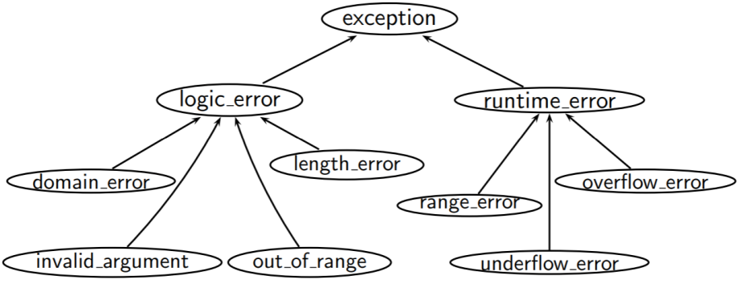
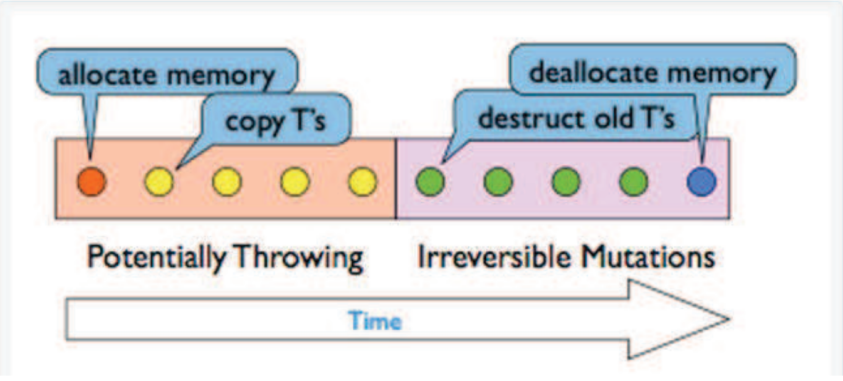

# Exceptions

The following section of code results in undefined behaviour when a number >3 is given as input:

``` cpp
#include <iostream>
#include <vector>
auto main() -> int {
    std::cout << "Enter -1 to quit\n";
    std::vector<int> items{97, 84, 72, 65};
    std::cout << "Enter an index: ";
    for (int print_index; std::cin >> print_index; ) {
        if (print_index == -1) break;
        std::cout << items.at(print_index) << '\n';
        std::cout << "Enter an index: ";
    }
}
```

The following program triggers exceptions and deals with them gracefully.

``` cpp
#include <iostream>
#include <vector>
auto main() -> int {
    std::cout << "Enter -1 to quit\n";
    std::vector<int> items{97, 84, 72, 65};
    std::cout << "Enter an index: ";
    for (int print_index; std::cin >> print_index; ) {
        if (print_index == -1) break;
        try {
            std::cout << items.at(print_index) << '\n';
            items.resize(items.size() + 10);
        } catch (const std::out_of_range& e) {
            std::cout << "Index out of bounds\n";
        } catch (...) {
            std::cout << "Something else happened";
        }
        std::cout << "Enter an index: ";
    }
}
```

**Exceptions** are for *exceptional* circumstances; anomalies that happen during run-time  
**Exception handling** is a run-time mechanism that deals with exceptions. C++ detects a run-time error and raises an appropriate exception. Another unrelated part of code catches the exception, handles it, and potentially rethrows it.  
This allows us to ***gracefully*** and programmatically deal with anomalies, as opposed to crashing our program.

## Exception Objects

**Exception Objects** are any type we derive from `std::exception`; e.g. `throw std::out_of_range("Exception!");` and `throw std::bad_alloc("Exception!");`.

To use standard exceptions we use `#include <stdexcept>`. All exceptions inherit `std::exception` which is the base class for all exception. You can find standard exceptions that inherit `std::exception` [here](https://en.cppreference.com/w/cpp/error/exception). A class can inherit from these types.



`<stdexcept>`: Defines a set of standard exceptions that both the library and programs can use to report common errors.  
`<exception>`: Defines the base class (i.e., std::exception) for all exceptions thrown by the elements of the standard library, along with several types and utilities to assist handling exceptions.

## Conceptual Structure

Exceptions are treated like lvalues (see [TODO](TODO)). There are limited type conversions that exist; non `const` to `const` and other conversion which will no be covered.

General structure for exception handling with `try catch` blocks

``` cpp
try {
    // Code that may throw an exception
} catch (/* exception type */) {
    // Do something with the exception
} catch (...) { // catch any exception
    // Do something with the exception
}
```

See more on the `try catch` block [here](https://en.cppreference.com/w/cpp/language/try_catch)

Having multiple catch options does not mean multiple catches will happen, but rather that multiple options are possible for a single catch

``` cpp
#include <iostream>
#include <vector>

auto main() -> int {
    std::vector<int> items;
    try {
        items.resize(items.max_size() + 1);
    } catch (std::bad_alloc& e) {
        std::cout << "Out of bounds.\n";
    } catch (std::exception&) {
        std::cout << "General exception.\n";
    }
}
```

## Catching the Right Way

In general, we **throw by value, catch by reference**.

Ways to catch exceptions:

* by value (**no**)
* by pointer (**no**)
* by reference (**yes**)

References are preferred because they are **more efficient** and require **less copying**. They do not have slicing problems (related to polymorphism, see [here](TODO))

Catch by value is inefficient. The following code uses catches catch by value and produces the following output

``` cpp
#include <iostream>
class giraffe {
public:
    giraffe() { std::cout << "giraffe constructed" << '\n'; }
    giraffe(giraffe const& g) { std::cout << "giraffe copy-constructed" << '\n'; }
    ~giraffe() { std::cout << "giraffe destructed" << '\n'; }
};

auto zebra() -> void {
    throw Giraffe{};
}

auto llama() -> void {
    try {
        zebra();
    } catch (giraffe g) {
        std::cout << "caught in llama; rethrow" << '\n';
        throw; // rethrow
    }
}

auto main() -> int {
    try {
        llama();
    } catch (giraffe g) {
        std::cout << "caught in main" << '\n';
    }
}
```

``` txt
giraffe constructed
giraffe copy-constructed
caught in llama; rethrow
giraffe destructed
giraffe copy-constructed
caught in main
giraffe destructed
giraffe destructed
```

The following code use catch by reference and produces the following output:

``` cpp
#include <iostream>
class giraffe {
public:
    giraffe() { std::cout << "giraffe constructed" << '\n'; }
    giraffe(giraffe const& g) { std::cout << "giraffe copy-constructed" << '\n'; }
    ~giraffe() { std::cout << "giraffe destructed" << '\n'; }
};

auto zebra() -> void {
    throw giraffe();
}

auto llama() -> void {
    try {
        zebra();
    } catch (giraffe const& g) {
        std::cout << "caught in llama; rethrow" << '\n';
        throw;
    }
}

auto main() -> int {
    try {
        llama();
    } catch (giraffe const& g) {
        std::cout << "caught in main" << '\n';
    }
}
```

``` txt
giraffe constructed
caught in llama; rethrow
caught in main
giraffe destructed
```

## Rethrow

When an exception is caught, by default the catch will be the only part of the code to use/action the exception.

If other catches (lower in the precedence order) want do something with the thrown exception, we will have to throw the exception again. This is known as a **rethrow**

``` cpp
try {
    try {
        try {
            throw T{};
        } catch (T& e1) {
            std::cout << "Caught\n";
            throw;
        }
    } catch (T& e2) {
        std::cout << "Caught too!\n";
        throw;
    }
} catch (...) {
    std::cout << "Caught too!!\n";
}
```

Example: a (not-advisable) rethrow using catch by value

``` cpp
#include <iostream>
class cake {
public:
    cake() : pieces_{8} {}
    get_pieces() -> int { return pieces_; }
    auto operator--() -> cake& { --pieces_; }
private:
    int pieces_;
};

int main() {
    try {
        try {
            try {
                throw cake{};
            } catch (cake& e1) {
                --e1;
                std::cout << "e1 Pieces: " << e1.get_pieces() << " addr: " << &e1 << "\n";
                throw;
            }
        } catch (cake e2) {
            --e2;
            std::cout << "e2 Pieces: " << e2.get_pieces() << " addr: " << &e2 << "\n";
            throw;
        }
    } catch (cake& e3) {
        --e3;
        std::cout << "e3 Pieces: " << e3.get_pieces() << " addr: " << &e3 << "\n";
    }
}
```

## Exception Safety Levels

Operations performed have various levels of safety:

* no-throw (failure transparance)
* strong exception safety (commit-or-rollback)
* weak exception safety (no-lea)
* no exception safety

### No-throw Guarantee

**No-throw guarantee** (or failure transparency) operations are guaranteed to succeed, even in exceptional circumstances. That is exceptions may occur, but they are handled gracefully.

No exceptions are visible to clients. This is the same, for all intents and purposes, as `noexcept` in C++

Examples:

* closing a file
* freeing memory
* anything done in constructors or moves (usually)
* creating a trivial object on the stack (made up of only `int`s)

### Strong Exception Safety

**Strong exception safety** (or "commit-or-rollback") operations can fail, but failed operations are guaranteed to have no visible effects.  
This is probably the most common level of exception safety for types in C++.

All your copy-constructors should generally follow these semantics. This is similar for cop-assignment:

* copy-and-swap idiom (usually) follows these semantics
* can be difficult when manually writing copy-assignment

To achieve strong exception safety, you need to;

1. Perform any operations that may throw, but do not do anything irreversible
2. Perform any operations that are irreversible, but do not throw



### Basic Exception Safety

**Basic exception safety** operations are also known as no-leak guarantee operations.

Partial execution of failed operations can cause side effects, but:

* All invariants must be preserved
* No resources are leaked

Any stored data will contain valid values, even if it is different from what is was before the exception. This means it will provide a valid but unspecified state.  
Move constructors that are `noexcept` follow these semantics

### No Exception Safety

**No exceptions** operators basically provide no guarantees.

Do not write C++ with no exception safety. It is very hard to debug when things go wrong. However, it is very easy to fix if you wrap your resources and attach lifetimes. This gives you basic exception safety for free.

### `noexcept` Specifier

`noexcept` specifies whether a function could potentially `throw`.  
STL functions can operate more efficiently on `noexcept` functions

``` cpp
class S {
public:
    int foo() const; // may throw
}

class S {
public:
    int foo() const noexcept; // does not throw
}
```

A `noexcept`-specified function tell the compiler to not generate recovery code. An exception thrown in a no except function will terminate your program.

Use `noexcept` to guarantee that callers do not need to worry about exception handling.  
You can use `noexcept` to say that you don't mind your whole program ending if something goes wrong in this function.  

We can mark all **class destructors** as `noexcept`, as destructors aren't allowed to throw exceptions

## Testing Exceptions

* checking `expr` does not throw an exception

    ``` cpp
    CHECK_NOTHROW(expr);
    ```

* checking `expr` throws an exception

    ``` cpp
    CHECK_THROWS(expr);
    ```

* checking `expr` throws type (or something derived from type)

    ``` cpp
    CHECK_THROWS_AS(expr, type);
    ```

* checking `expr` throws an exception with a message

    ``` cpp
    namespace Matchers = Catch::Matchers;
    CHECK_THROWS_WITH(expr, Matchers::Messge("message"));
    ```

* `CHECK_THROW_AS` and `CHECK_THROWS_WITH` in a single check:

    ``` cpp
    CHECK_THROW_MATCHES(expr, type, Matchers::Message("message"));
    ```
