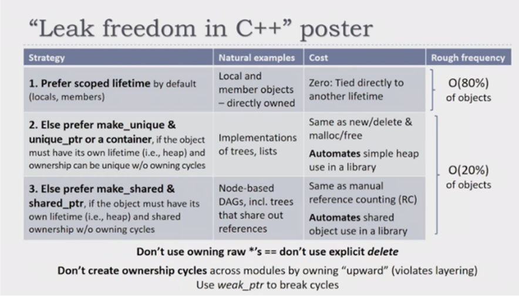

# Smart Pointers

Recall that to create safe object lifetimes in C++, we always attach the lifetime of one object to that of something else. We need to be careful that ***objects always outlive their references***.

Creating a *safe* pointer:  
Note: don't use `new`/`delete` keywords in your actual code. These are for demo purposes

``` cpp
// myintpointer.h
class MyIntPointer {
public:
    // This is the constructor
    MyIntPointer(int* value);

    // This is the destructor
    ~MyIntPointer();

    int* GetValue();

private:
    int* value_;
};

// myintpointer.cpp
#include "myintpointer.h"

MyIntPointer::MyIntPointer(int* value): value_{value} {}

int* MyIntPointer::GetValue() {
    return value_;
}

MyIntPointer::~MyIntPointer() {
    // Similar to C's free function.
    delete value_;
}

void fn() {
    // Similar to C's malloc
    MyIntPointer p{new int{5}};
    // Copy the pointer;
    MyIntPointer q{p.GetValue()};
    // p and q are both now destructed.
    // but since they point to the same thing
    // we get a double free
}
```

## Smart Pointer

**Smart pointers** are a way of wrapping unnamed (i.e raw pointer) heap objects in named stack objects so that object lifetimes can be managed much easier. They were introduced in C++11.

There are usually two ways of approaching heap-based object problems:

* `unique_ptr` + raw pointers ("observers")
* `shared_ptr` + `weak_ptr`/raw pointers

| Type                 | Shared Ownership | Take Ownership |
| ---                  | ---              | ---            |
| `std::unique_ptr<T>` | No               | Yes            |
| raw pointers         | No               | No             |
| `std::shared_ptr<T>` | Yes              | Yes            |
| `std::weak_ptr<T>`   | No               | No             |

### Unique Pointer

The **unique pointer**, `std::unique_ptr<T>`, owns the object. When the unique pointer is destructed, the underlying object is too. There is no copy constructor or copy assignment for unique pointers. This is because only **ONE** unique pointer can own the object. Instead we can transfer ownership by using `std::move`. The unique pointer may have many observers.

The **raw pointer (observer)** is an appropriate use of raw pointers (or references) in C++. Once the original pointer is destructed, you must ensure you don't access the raw pointers (no checks exist). These observers **do not** have ownership of the pointer.

Also note the use of `nullptr` in C++ instead of `NULL`

Unique pointer usage:

``` cpp
#include <memory>
#include <iostream>

int main() {
    std::unique_ptr<int> up1{new int};
    std::unique_ptr<int> up2 = up1; // no copy constructor
    std::unique_ptr<int> up3;
    up3 = up2; // no copy assignment
    up3.reset(up1.release()); // OK
    std::unique_ptr<int> up4 = std::move(up3); // OK
    std::cout << up4.get() << "\n"; // returns the address unique_ptr points to
    std::cout << *up4 << "\n";
    std::cout << *up1 << "\n";
}
```

Observer pointer usage:

``` cpp
#include <memory>
#include <iostream>

int main() {
    std::unique_ptr<int> up1(new int{0});
    *up1 = 5;
    std::cout << *up1 << "\n";
    int* op1 = up1.get(); // we can't use op1 = up1 or it'll assume
                          // we are trying to make another unique pointer
    *op1 = 6;
    std::cout << *op1 << "\n";
    up1.reset();
    std::cout << *op1 << "\n";
}
```

Unique pointer operators:

``` cpp
#include <memory>
#include <iostream>
int main() {
    // 1 - Worst - you can accidentally own the resource multiple
    // times, or easily forget to own it.
    int *i = new int;
    auto up1 = std::make_unique<std::string>(i);
    auto up11 = std::make_unique<std::string>(i);

    // 2 - Not good - requires actual thinking about whether there's a leak.
    std::unique_ptr<std::string> up2{new std::string{"Hello"}};

    // 3 - Good - no thinking required.
    std::unique_ptr<std::string> up3 = std::make_unique<std::string>("Hello");
    std::cout << *up3 << "\n";
    std::cout << *(up3.get()) << "\n";
    std::cout << up3->size();
}
```

### Shared Pointer

For the shared pointer, `std::shared_ptr<T>`, several shared pointers **share** ownership of the object. It is a reference counted pointer. When a shared pointer is destructed, **if it is the only shared pointer left** pointing at the object, then the **object is destroyed**.

Shared pointers may also have many observers. Just because the pointer has shared ownership does not mean the observers should get ownership too.

Weak pointers, `std::weak_ptr<T>`, are used with shared pointers when:

* you don't want to add to the reference count
* you want to be able to check if the underlying data is still valid before using it

Shared pointer usage:

``` cpp
#include <memory>
#include <iostream>

int main() {
    std::shared_ptr<int> x(new int{5});
    std::shared_ptr<int> y = x; // Both now own the memory
    std::cout << "use count: " << x.use_count() << "\n";
    std::cout << "value: " << *x << "\n";
    x.reset(); // Memory still exists, due to y.
    std::cout << "use count: " << y.use_count() << "\n";
    std::cout << "value: " << *y << "\n";
    y.reset(); // Deletes the memory, since
    // no one else owns the memory
    std::cout << "use count: " << x.use_count() << "\n";
    std::cout << "value: " << *y << "\n"; // does not work
}
```

Weak pointer usage:

``` cpp
#include <memory>
#include <iostream>
int main() {
    std::shared_ptr<int> x = std::make_shared<int>(1);
    std::weak_ptr<int> wp = x; // x owns the memory
    {
        std::shared_ptr<int> y = wp.lock(); // x and y own the memory
        if (y) {
            // Do something with y
            std::cout << "Attempt 1: " << *y << '\n';
        }
    } // y is destroyed. Memory is owned by x
    x.reset(); // Memory is deleted
    std::shared_ptr<int> z = wp.lock(); // Memory gone; get null ptr
    if (z) {
        // will not execute this
        std::cout << "Attempt 2: " << *z << '\n';
    }
}
```

### Unique Pointer vs. Shared Pointer

You almost always want a unique pointer over a shared pointer.  
Use a shared pointer if either:

* An object has multiple owners, and **you don't know which one will stay around longest**
* You need temporary ownership (outside scope of this course). This is very rare.



## Stack Unwinding

**Stack unwinding** is the process of exiting stack frames until we find an exception handler for the function. This calls any destructors on the way out. Any resources not managed by destructors won't get freed up. If an exception is thrown during stack unwinding, `std::terminate` is called.

Not safe:

``` cpp
void g() {
    throw std::runtime_error{""};
}

int main() {
    auto ptr = new int{5};
    g();
    // Never executed.
    delete ptr;
}
```

Safe:

``` cpp
void g() {
    throw std::runtime_error{""};
}

int main() {
    auto ptr = std::make_unique<int>(5);
    g();
}
```

### Exceptions & Destructors

During stack unwinding, `std::terminate()` will be called if an exception leaves a destructor. The resources may not be released properly if an exception leaves a destructor. All exceptions that occur inside a destructor should be handled inside the destructor. Destructors usually don't throw, and need to explicitly opt in to throwing. STL types do not do that.

### Partial Construction

What happens if an exception is thrown halfway through a constructor?  
The C++ standard: *"An object that is partially constructed or partially destroyed will have destructors executed for all of its fully constructed sub-objects"*.  
A destructor is not called for an object that was partially constructed except for an exception thrown in a constructor that delegates

In our code below, we will have memory leaks. The `unsafe_class` will throw an exception when assigning `b` and will call destructors for sub-object `a`. Since `a` is a raw pointer, it won't actually free memory.

``` cpp
#include <exception>

class my_int {
public:
    my_int(int const i) : i_{i} {
        if (i == 2) {
            throw std::exception();
        }
    }

private:
    int i_;
};

class unsafe_class {
public:
    unsafe_class(int a, int b)
    : a_{new my_int{a}}
    , b_{new my_int{b}}
    {}

    ~unsafe_class() {
        delete a_;
        delete b_;
    }
private:
    my_int* a_;
    my_int* b_;
};

int main() {
    auto a = unsafe_class(1, 2);
}
```

The solution to this is:

1. Try-catch in the constructor:  
Very messy, but works (if you get it right). It doesn't work with initialiser lists (and need to be in the body)
2. An object managing resource should initialise the resource last.  
The resource is only initialised when the whole object is. As a consequence, an object can only manage one resource. If you want to manage multiple resources, instead mange several wrappers, which each manage one resource

``` cpp
#include <exception>
#include <memory>

class my_int {
public:
    my_int(int const i)
    : i_{i} {
        if (i == 2) {
            throw std::exception();
        }
    }
private:
    int i_;
};

class safe_class {
public:
    safe_class(int a, int b)
    : a_(std::make_unique<my_int>(a))
    , b_(std::make_unique<my_int>(b))
    {}
private:
    std::unique_ptr<my_int> a_;
    std::unique_ptr<my_int> b_;
};

int main() {
    auto a = safe_class(1, 2);
}
```

## Reference Types

A **reference type** is a type that acts as an abstraction over a raw pointer.

They don't own a resource, but allow us to do cheap operations like copy, move, and destroy on objects that do.

A reference type to a range of elements is called a **view**

``` cpp
class string_view6771 {
public:
    string_view6771() noexcept = default;

    explicit(false) string_view6771(std::string const& s) noexcept
    : string_view6771(s.data())
    {}

    explicit(false) string_view6771(char const* data) noexcept
    : string_view6771(data, std::strlen(data))
    {}

    string_view6771(char const* data, std::size_t const length) noexcept
    : data_{data}
    , length_{length}
    {}

    auto begin() const noexcept -> char const* { return data_; }
    auto end() const noexcept -> char const* { return data_ + length_; }
    auto size() const noexcept -> std::size_t { return length_; }
    auto data() const noexcept -> char const* { return data_; }

    auto operator[](std::size_t const n) const noexcept -> char {
        assert(n < length_);
        return data_[n];
    }
private:
    char const* data_ = nullptr;
    std::size_t length_ = 0;
};
```

| Reference Type                       | Description |
| ---                                  | ---                                                                    |
| `T*`, `T const*`                     | Raw pointer to a single object or to an element in a range. Wherever possible, prefer references, iterators, or something below. |
| `std::string_view`                   | Abstraction over **immutable** string-like data.                       |
| `std::span<T>`, `std::span<T const>` | Abstraction over array-like data.                                      |
| Most `ranges::views::*`              | **Lazy** abstraction over a range, associated with some transformation |

A look at `std::span`:

``` cpp
auto zero_out(std::span<int> const x) -> void {
    ranges::fill(x, 0);
}

{
    auto numbers = views::iota(0, 100) | ranges::to<std::vector>;
    zero_out(numbers);
    CHECK(ranges::all_of(numbers, [](int const x) { return x == 0; }));
}

{
    // Using int[] since spec requires we use T[] instead of std::vector
    // NOLINTNEXTLINE(modernize-avoid-c-arrays)
    auto const raw_data = std::make_unique<int[]>(42);
    auto const usable_data = std::span<int>(raw_data.get(), 42);
    zero_out(usable_data);
    CHECK(ranges::all_of(usable_data, [](int const x) { return x == 0; }));
}

auto zero_exists(std::span<int const> const x) -> bool {
    ranges::any_of(x, [](int const x) { return x == 0; });
}

{
    auto numbers = views::iota(0, 100) | ranges::to<std::vector>;
    CHECK(zero_exists(numbers));
}

{
    // Using int[] since ass2 spec requires we use T[] instead of std::vector
    // NOLINTNEXTLINE(modernize-avoid-c-arrays)
    auto const raw_data = std::make_unique<int[]>(42);
    auto const usable_data = std::span<int>(raw_data.get(), 42);
    CHECK(zero_exists(usable_data));
}
```

`NOLINTNEXTLINE(check)` turns off a check on the following line.  
**Do this rarely, and always provide justification immediately above**.

## Iterators and Pointers

> *"A pointer is an abstraction of a virtual memory address"* - [Sy Brand](https://twitter.com/TartanLlama/status/1272929887435792385?s=20)
>
> *"Iterators are a family of concepts that abstract different aspects of addresses"* - [Elements of Programming, Stepanov & McJones](http://elementsofprogramming.com/)
>
> *"Iterators are a generalisation of pointers that allow a C++ programm to work with different data structures... in a uniform manner"* - [Working Draft, Standard for Programming Language C++](http://eel.is/c++draft/iterators#iterator.requirements.general-1)

We need to be very careful when returning references.  
***The object must always outlive the reference***

``` cpp
auto v = std::vector<int>{0, 1, 2, 3};
auto const* p = v.data();

{
    CHECK(*p == 0); // okay: p points to memory owned by v
}

v = std::vector<int>{0, 1, 2, 3};

{
    CHECK(*p == 0); // error: p points to memory owned by no one
}
```

``` cpp
// s is a local; will be destroyed before its observer
auto not_okay1(std::string s) -> std::string_view {
    return s;
} // s destroyed here

// s may be destroyed before observer (if rvalue passed in)
// considered harmful
// e.g. auto x = not_okay("hello")
auto not_okay2(std::string const& s) -> std::string_view {
    return s;
}

// observer in, observer out
auto okay1(std::string_view const sv) -> std::string_view {
    return sv;
}

// lvalue reference in, observer out
auto okay2(std::string& s) -> std::string_view {
    return s;
}
```

``` cpp
auto is_even(int const x) -> bool {
    return x % 2 == 0;
}

auto not_okay1(std::vector<int> v) {
    return v | views::filter(is_even);
} // v destroyed here

auto not_okay2(std::vector<int> const& v) {
    return v | views::filter(is_even);
}

auto okay1(std::span<int> s) {
    return s | views::filter(is_even);
}

auto okay2(std::vector<int>& v) {
    return v | views::filter(is_even);
}
```
