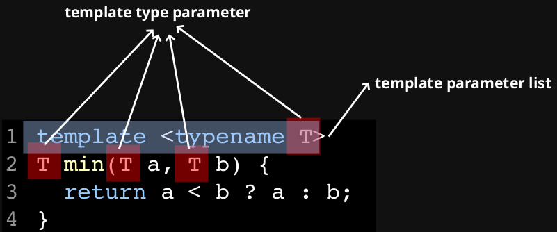

# Templates

**Polymorphism** is the provision of a single interface to entities of different types. There are two types of polymorphism:

* **static**
    * function overloading
    * templates (i.e. generic programming); e.g. `std::vector<int>`, `std::vector<double>`
* **dynamic** - related to virtual functions and inheritance

**Generic programming** is the generalisation of software components to be independent of a particular type. STL is a great example of generic programming.

## Function Templates

Without generic programming, to create two logically identical functions that behave in a way that is independent to the type, we have to reply on function overloading.

``` cpp
#include <iostream>

auto min(int a, int b) -> int {
    return a < b ? a : b;
}

auto min(double a, double b) -> double {
    return a < b ? a : b;
}

auto main() -> int {
    std::cout << min(1, 2) << "\n";     // calls min(int, int)
    std::cout << min(1.0, 2.0) << "\n"; // calls min(double, double)
}
```

**Function templates** are *"instructions"* for the compiler to generate particular instances of a function varying by type. The generation of a templated function for a particular type `T` only happens when a call to that function is seen during compile time.

``` cpp
#include <iostream>

template <typename T>
auto min(T a, T b) -> T {
    return a < b ? a : b;
}

auto main() -> int {
    std::cout << min(1, 2) << "\n";     // calls min<int>(int, int)
    std::cout << min(1.0, 2.0) << "\n"; // calls min<double>(double, double)
}
```

Some terminology:



### Type and Non-Type Parameters

A **type parameter** is an ***unknown*** type with no value.  
A **non-type parameter** is a ***known*** type with an unknown value

``` cpp
#include <array>
#include <iostream>
template<typename T, std::size_t size>
auto findmin(const std::array<T, size> a) -> T {
    // compiler deduce T and size from a
    T min = a[0];
    for (std::size_t i = 1; i < size; ++i) {
        if (a[i] < min)
            min = a[i];
    }
    return min;
}

auto main() -> int {
    std::array<int, 3> x{3, 1, 2};
    std::array<double, 4> y{3.3, 1.1, 2.2, 4.4};
    std::cout << "min of x = " << findmin(x) << "\n";
    std::cout << "min of x = " << findmin(y) << "\n";
}
```

At compile time, the following functions are generated:

``` cpp
auto findmin(const std::array<int, 3> a) -> int {
    int min = a[0];
    for (int i = 1; i < 3; ++i) {
        if (a[i] < min)
            min = a[i];
    }
    return min;
}

auto findmin(const std::array<double, 4> a) -> double {
    double min = a[0];
    for (int i = 1; i < 4; ++i) {
        if (a[i] < min)
            min = a[i];
    }
    return min;
}
```

Having specific templates can give us less computation, but can result in a *code explosion* and large binaries.

## Class Templates

If we were to make a stack by explicitly declaring it's type, we would have an administrative *nightmare* and lexical complexity (need to learn all type names);

``` cpp
class int_stack {
public:
    auto push(int&) -> void;
    auto pop() -> void;
    auto top() -> int&;
    auto top() const -> const int&;
private:
    std::vector<int> stack_;
};

class double_stack {
public:
    auto push(double&) -> void;
    auto pop() -> void;
    auto top() -> double&;
    auto top() const -> const double&;
private:
    std::vector<double> stack_;
};
```

Instead we can use a class template; class templates allow us to create a class that can work with multiple data types.

``` cpp
// stack.h
#ifndef STACK_H
#define STACK_H

#include <iostream>
#include <vector>

template<typename T>
class stack {
public:
    friend auto operator<<(std::ostream& os, const stack& s) -> std::ostream& {
        for (const auto& i : s.stack_)
            os << i << " ";
        return os;
    }
    auto push(T const& item) -> void;
    auto pop() -> void;
    auto top() -> T&;
    auto top() const -> const T&;
    auto empty() const -> bool;

private:
    std::vector<T> stack_;
};

#include "./stack.tpp"

#endif // STACK_H
```

``` cpp
// stack.tpp
#include "./demo705-classtemp.h"
template<typename T>
auto stack<T>::push(T const& item) -> void {
    stack_.push_back(item);
}

template<typename T>
auto stack<T>::pop() -> void {
    stack_.pop_back();
}

template<typename T>
auto stack<T>::top() -> T& {
    return stack_.back();
}

template<typename T>
auto stack<T>::top() const -> T const& {
    return stack_.back();
}

template<typename T>
auto stack<T>::empty() const -> bool {
    return stack_.empty();
}
```

``` cpp
#include <iostream>
#include <string>
#include "./stack.h"
int main() {
    stack<int> s1; // int: template argument
    s1.push(1);
    s1.push(2);
    stack<int> s2 = s1;
    std::cout << s1 << s2 << '\n';
    s1.pop();
    s1.push(3);
    std::cout << s1 << s2 << '\n';
    // s1.push("hello"); // Fails to compile.

    stack<std::string> string_stack;
    string_stack.push("hello");
    // string_stack.push(1); // Fails to compile.
}
```

The rule-of-five (does not have to be implemented in this case and) is defaulted to:

``` cpp
template <typename T>
stack<T>::stack() { }

template <typename T>
stack<T>::stack(const stack<T> &s) : stack_{s.stack_} { }

template <typename T>
stack<T>::stack(Stack<T> &&s) : stack_(std::move(s.stack_)); { }

template <typename T>
stack<T>& stack<T>::operator=(const stack<T> &s) {
    stack_ = s.stack_;
}

template <typename T>
stack<T>& stack<T>::operator=(stack<T> &&s) {
    stack_ = std::move(s.stack_);
}

template <typename T>
stack<T>::~stack() { }
```

## Inclusion Compilation Model

If we try to compile the following code wiht `g++ min.cpp, main.cpp -o main`, we'll get a compilation error:

``` cpp
// min.h
template <typname T>
auto min(T a, T b) -> T;

// min.cpp
template <typname T>
auto min(T a, T b) -> T {
    return a < b ? a : b;
}

// main.cpp
#include <iostream>

auto main() -> int {}
    std::cout << min(1, 2) << "\n";
```

When it comes to templates, we include definitions (i.e. Implementation) in the `.h[pp]` file. This is because template definitions need to be known at **compile time**; template definitions can't be instantiated at link time, because that would require instantiation for all types.

This will expose implementation details in the `.h[pp]` file. This can cause slowdown in compilation as every file using the header file will have to instantiate the template, then it's up to the linker to ensure there is only 1 instantiation.

For our example above, we'd have to do:

``` cpp
// min.h
template <typname T>
auto min(T a, T b) -> T {
    return a < b ? a : b;
}

// main.cpp
#include <iostream>

auto main() -> int {}
    std::cout << min(1, 2) << "\n";

```

### Explicit Instantiation

An alternative would be to have explicit instantiations; this is generally a **bad idea**.

``` cpp
// min.h
template <typname T>
auto min(T a, T b) -> T;

// min.cpp
template <typname T>
auto min(T a, T b) -> T {
    return a < b ? a : b;
}

template int min<<int>(int, int);
template double min<<double>(double, double);

// main.cpp
#include <iostream>

auto main() -> int {}
    std::cout << min(1, 2) << "\n";
    std::cout << min(1.0, 2.0) << "\n";
}
```

### Lazy Instantiation

Templates are **lazy instantiated**, meaning only member functions that are called are instantiated. In the case of our simplified stack template class below, `pop()` will not be instantiated.

``` cpp
// stack.hpp
#include <vector>

template <typename T>
class stack {
public:
    stack() {}
    auto pop() -> void;
    auto push(const T& i) -> void;
private:
    std::vector<T> items_;
}

#include "stack.tpp"

// stack.tpp
template <typename T>
auto stack<T>::pop() -> void {
    items_.pop_back();
}

template <typename T>
auto stack<T>::push(const T& i) -> void {
    items_.push_back(i);
}

// main.cpp
auto main() -> int {
    stack<int> s;
    s.push(5);
}
```

The exact same principles will apply for classes; implementations must be in the header file, and the compiler should only behave as it one `stack<int>` was instantiated

## Static Members

Each template instantiation has its own set of static members:

``` cpp
// static.h
#include <vector>

template<typename T>
class stack {
public:
    stack();
    ~stack();
    auto push(T&) -> void;
    auto pop() -> void;
    auto top() -> T&;
    auto top() const -> const T&;
    static int num_stacks_;

private:
    std::vector<T> stack_;
};

template<typename T>
int stack<T>::num_stacks_ = 0;

template<typename T>
stack<T>::stack() {
    num_stacks_++;
}

template<typename T>
stack<T>::~stack() {
    num_stacks_--;
}

// static.cpp
#include <iostream>

#include "./static.h"

auto main() -> int {
    stack<float> fs;
    stack<int> is1, is2, is3;
    std::cout << stack<float>::num_stacks_ << "\n"; // prints 1
    std::cout << stack<int>::num_stacks_ << "\n";   // prints 3
}
```

## Friends

Each stack instantiation has one unique implementation of the friend.

``` cpp
// friend.h
#include <iostream>
#include <vector>

template<typename T>
class stack {
public:
    auto push(T const&) -> void;
    auto pop() -> void;

    friend auto operator<<(std::ostream& os, stack<T> const& s) -> std::ostream& {
        return os << "My top item is " << s.stack_.back() << "\n";
    }

private:
    std::vector<T> stack_;
};

template<typename T>
auto stack<T>::push(T const& t) -> void {
    stack_.push_back(t);
}

// friend.cpp
#include <iostream>
#include <string>
#include "./friend.h"
auto main() -> int {
    stack<std::string> ss;
    ss.push("Hello");
    std::cout << ss << "\n": // My top item is Hello

    stack<int> is;
    is.push(5);
    std::cout << is << "\n": // My top item is 5
}
```

## `constexpr`

We can provide default arguments to template types (where the defaults themselves are types). It means we have to update all of our template parameter lists.

We can mark as `constexpr` either:

* a **variable** that can be calculated at compile time
* a **function** that, if its inputs are known at compile time, can be run at compile time

``` cpp
#include <iostream>

// This can be called at compile time, or at runtime
constexpr int constexpr_factorial(int n) {
    return n <= 1 ? 1 : n * constexpr_factorial(n - 1);
}

// This may not be called at compile time
int factorial(int n) {
    return n <= 1 ? 1 : n * factorial(n - 1);
}

auto main() -> int {
    // Beats a #define any day.
    constexpr int max_n = 10;

    constexpr int tenfactorial = constexpr_factorial(10);

    // This will fail to compile
    int ninefactorial = factorial(9);

    std::cout << max_n << "\n";
    std::cout << tenfactorial << "\n";
    std::cout << ninefactorial << "\n";
}
```

Benefits of `constexpr`:

* values that can be determined at compile time mean less processing needed at runtime, resulting in an overall **faster** program execution
* shifts potential sources of errors to compile time instead of runtime; **easier to debug**
