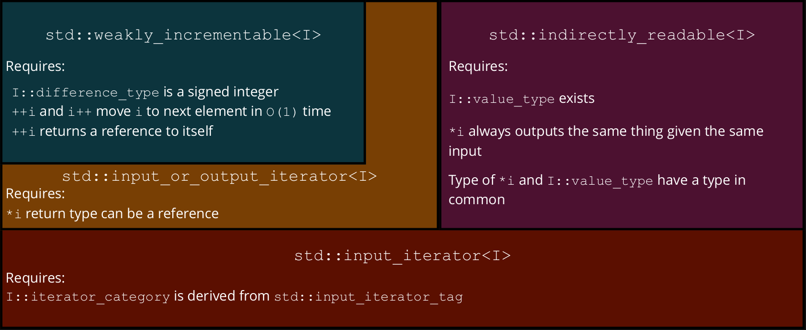
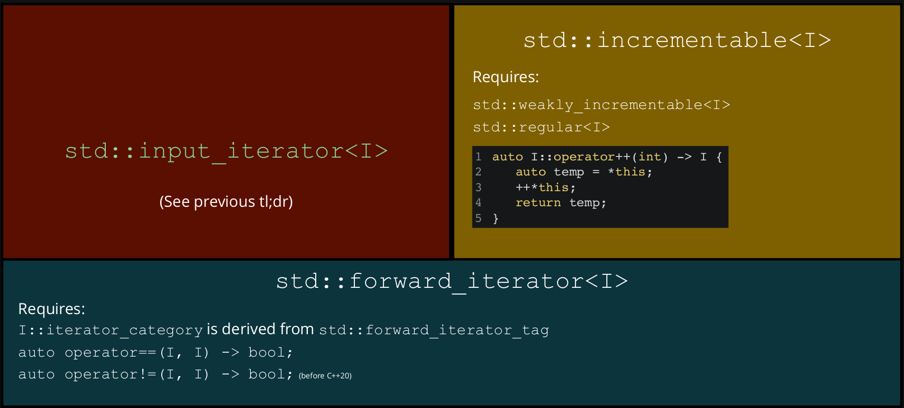
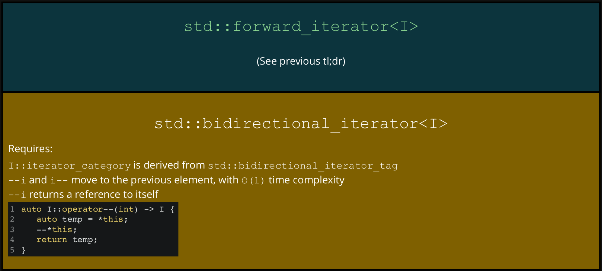
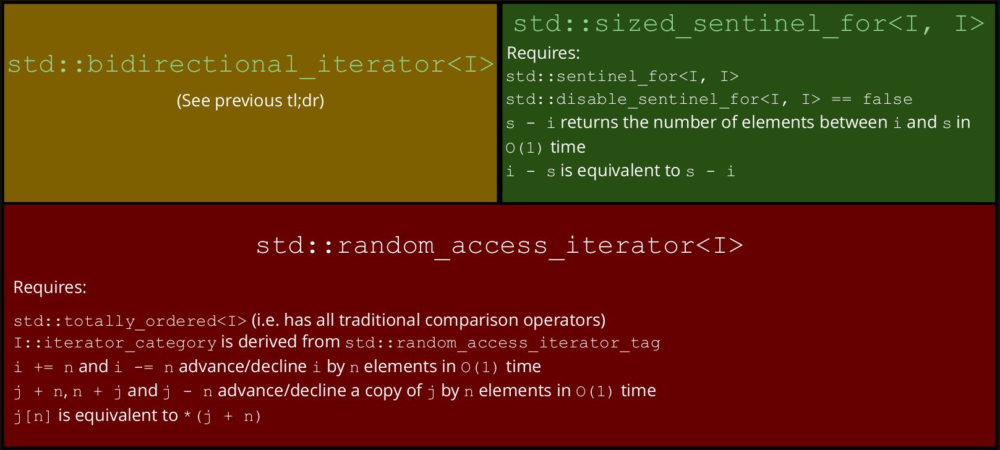
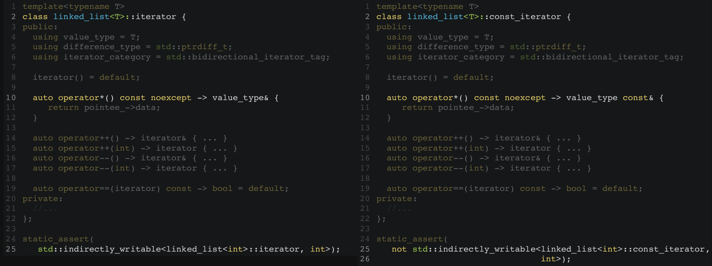

# Generic Programming

## Concepts

> *"Somewhat more formally, a **concept** is a description of requirements on one or more types stated in terms of the existence and properties of procedures, type attributes, and type functions defined on the types."* - Elements of Programming, by Alexander Stepanov and Paul McJones

**Concepts** are essentially a way we describe requirements on types. We use the requirements to describe properties for our algorithms; e.g. syntax requirements, semantic requirements, complexity requirements.

A **constraint** is a syntax requirement. The compiler can check these.

An **axiom** is a semantic requirement. The compiler can't check these, but librarians may assume that they hold **true** forever. Pre-condition (and post-condition) checks can sometimes check at runtime.  
Axioms are usually provided via comments in-tandem with the constraints.

**Complexity requirements** don't have a fancy name, and can't be checked by the implementation, nor the library author. A sophisticated [benchmarking tool](https://github.com/google/benchmark/#asymptotic-complexity) might be able to do so.

We say that a type *satisfies* the requirements if all the constraints evaluate as true. We say a type *models* the concept if, and only if, it satisfies the requirements and meets the axioms and complexity requirements.

### Concepts in C++

You can think of concepts as a predicate that understand how to work with types:

``` cpp
template<typename T>
concept type = true; // syntax: concept concept_name = predicate;

template<typename T>
requires type<T> // require that the T satisfies predicate 'type'
void hello(T) {
    std::cout << "Permissive, base-case\n";
}

int main() {
    hello(0);
    hello(0.0);
    hello("base-case");
}
```

is equivalent to:

``` cpp
template<typename T> // deduce the type and check
concept type = true; // the constraints are satisfied

template<type T> // same as using `typename` right now
void hello(T) {
    std::cout << "Permissive, base-case\n";
}

int main() {
    hello(0);
    hello(0.0);
    hello("base-case");
}
```

Concepts with *actual* constraints:

``` cpp
template<typename T>
concept integral = std::is_integral_v<T>; // return true for integers, otherwise false

// must pass in an integral type to call hello()
template<integral T>
void hello(T) {
    std::cout << "Integral case\n";
}

int main() {
    hello(0);
    //hello(0.0);         // won't compile
    //hello("base-case"); // won't compile
}
```

``` cpp
template<typename T>
concept floating_point = std::is_floating_point_v<T>;

void hello(floating_point auto f) {
    std::cout << "Floating-point case\n";
}

int main() {
    // hello(0);          // won't compile
    hello(0.0);
    //hello("base-case"); // won't compile
}
```

Assuming all our concepts have been defined, we can do the following:

``` cpp
#include <iostream>
#include <type_traits>

template<typename T>
concept integral = std::is_integral_v<T>;

template<typename T>
concept floating_point = std::is_floating_point_v<T>;

void hello(integral auto)       { std::cout << "Integral case\n";       }
void hello(floating_point auto) { std::cout << "Floating-point case\n"; }
void hello(auto)                { std::cout << "Base-case\n";           }

int main() {
    hello(0);           // prints "Integral case"
    hello(0.0);         // prints "Floating-point case"
    hello("base case"); // prints "Base-case"
}
```

### Refining and Weakening Concepts

A concept C2 ***refines*** a concept C1, if whenever C2 is modelled, C1 is also modelled (i.e. satisfies constraints, axioms and complexity requirements). You can think of it as C2's properties being a superset of C1's; it extends C1's properties.  
A concept C2 ***weakens*** a concept C1, if its requirements are a proper subset of C1.

``` cpp
#include <iostream>
#include <type_traits>

template<typename T>
concept integral = std::is_integral_v<T>;

void hello(integral auto) { std::cout << "Integral case\n"; }

template<typename T>
concept signed_integral = integral<T> and std::is_signed_v<T>; // refines integral, has all the
                                                               // properties of integral and more

void hello(signed_integral auto) { std::cout << "Signed integral case\n"; }

int main() {
    hello(0); // prints "Signed integral case"
    hello(0U); // prints "Integral case"
}
```

### Library Concepts

C++20 introduced concepts as a language feature, along with three families of highly usable concepts.

Due to many reasons they are available in GCC 10 and recent versions of MSVC but not Clang with `libc++`.

There is a 1:1 mapping between concepts in range-v1 and what's in the standard library.

| Concepts family | Relevant header | `CMakeLists` `LINK` | Namespace |
| ---             | ---             | ---                 | ---       |
| [Concepts library](https://en.cppreference.com/w/cpp/concepts)   | `<concepts/concepts.hpp>` | `concepts::concepts` | `concepts` |
| [Iterators library](https://en.cppreference.com/w/cpp/iterators) | `<range/v3/iterator.hpp>` | `range-v3`           | `ranges`   |
| [Ranges library](https://en.cppreference.com/w/cpp/ranges)       | `<range/v3/range.hpp>`    | `range-v3`           | `ranges`   |

### Why Concepts?

With normal templates, errors are not particularly readable/easily understood:

``` cpp
struct equal_to {
    template<typename T, typename U>
    auto operator()(T const& t, U const& u) const -> bool {
        return t == u;
    }
};

auto main() -> void {
    equal_to{}(0, 0);                           // okay, returns true
    equal_to{}(std::vector{0}, std::vector{1}); // okay, returns false
    equal_to{}(0, 0.0);                         // okay, returns true
    equal_to{}(0.0, 0);                         // okay, returns true
    equal_to{}(0, std::vector<int>{});          // error: `int == vector` not defined
}
```

With concepts, the errors make more sense:

``` cpp
struct equal_to {
    template<typename T, std::equality_comparable_with<T> U>
    // U must be comparable with T
    auto operator()(T const& t, U const& u) const -> bool {
        return t == u;
    }
};

auto main() -> void {
    equal_to{}(0, 0);                           // okay, returns true
    equal_to{}(std::vector{0}, std::vector{1}); // okay, returns false
    equal_to{}(0, 0.0);                         // okay, returns true
    equal_to{}(0.0, 0);                         // okay, returns true
    equal_to{}(0, std::vector<int>{});          // still error, but makes more sense
}
```

### Regularity

``` cpp
template<typename T>
concept movable = std::is_object_v<T>
              and std::move_constructible<T>
              and std::assignable_from<T&, T> // move assignable
              and std::swappable<T>;

template<typename T>
concept copyable = std::copy_constructible<T>
               and std::movable<T>
               and std::assignable_from<T&, T const&>; // copy assignable; T const& is the parameter
                                                       // T& is the object being assigned

template<typename T>
concept semiregular = std::copyable<T> and std::default_initializable<T>;

template<typename T>
concept regular = std::semiregular<T> and sts::equality_comparable<T>;
// equality_comparable => comparable with objects of the same type
```

## Iterators

Iterators allow us to generic algorithms that can work on many data structures; e.g. a generic find:

``` cpp
auto const v = std::deque<int>{0, 1, 2, 3, 4, 5, 6, 7, 8, 9};
auto result = ranges::find(v.begin(), v.end(), 6);
if (result != v.end()) {
    std::cout << "Found 6\n";
} else {
    std::cout << "Didn't find 6.\n";
}
```

Quick links to tl;drs cause this is too damn long:

* [readable iterators](#readable-iterators-tldr)
* [forward iterators](#forward-iterators-tldr)
* [bidirectional iterators](#bidirectional-iterators-tldr)
* [random access iterators](#random-access-iterators)
* [writeable iterators](#writeable-iterators)
* [output iterators](#output-iterators)
* [const iterators](#iterators-and-const)

### Iterator Invalidation

An **iterator** is an abstract notion of a **pointer**. When we modify a container we are iterating through, iterators may be invalidated. Using an invalid iterator results in undefined behaviour.

Invalidation for [`push_back`](https://en.cppreference.com/w/cpp/container/vector/push_back):  
Think about the way a vector is stored. "If the new `size()` is greater than `capacity()` then all iterators and references (including the past-the-end iterator) are invalidated. Otherwise only the past-the-end iterator is invalidated."

``` cpp
auto v = std::vector<int>{1, 2, 3, 4, 5};

// Copy all 2s
for (auto it = v.begin(); it != v.end(); ++i) {
    if (*it == 2) {
        v.push_back(2);
    }
}
```

Invalidation for [`erase`](https://en.cppreference.com/w/cpp/container/vector/erase):  
"Invalidates iterators and references at or after the point of erase, including the `end()` iterator". For this reason, erase returns a new iterator.

``` cpp
auto v = std::vector<int>{1, 2, 3, 4, 5};

// Erase all even numbers
for (auto it = v.begin(); it != v.end(); ) {
    if (*it % 2 == 0) {
        it = v.erase(it);
    } else {
        ++it;
    }
}
```

Containers generally don't invalidate when you modify values, but they may invalidate when removing are adding elements.

* `std::vector` invalidates everything when adding elements (your iterators, pointers and references)
* `std::unordered_(map|set)` invalidates all iterators when adding elements; pointers and references will be safe
* `std::map` and `std::set` don't invalidated iterators upon insertion, only removed iterators are invalidated.

### Iterator Adaptors

There are two types of iterator adaptors:

* a wrapper around a type to ***grant that that iterator properties***
* a wrapper around an iterator type to ***grant additional or different iterator properties***

E.g. `std::reverse_iterator` is an iterator adaptor that transforms an existing iterator's `operator++` to mean "move backward" and `operator--` to mean "move forward".

``` cpp
std::reverse_iterator<std::vector<int>::iterator>
```

### Readable iterators

| Operation      | Array-like                | Node-based    | Iterator    |
| ---            | ---                       | ---           | ---         |
| Iteration type | `gsl_lite::index`         | `node*`       | unspecified |
| Read element   | `v[i]`                    | `i->value`    | `*i`        |
| Successor      | `j = i + n < ranges::distance(v) ? i + n : ranges::distance(v)` | `j = i->successor(n)` | `ranges::next(i, s, n)` |
| Advance fwd    | `++i`                     | `i = i->next` | `++i`       |
| Comparison     | `i < ranges::distance(v)` | `i != nullptr`| `i != s`    |

#### Indirectly Readable

An object is [indirectly readable](https://en.cppreference.com/w/cpp/iterator/indirectly_readable) if we are able to read it through another object.

A type `I` models the concept `std::indirectly_readable` if:

1. These types exist
    * `std::iter_value_t<I>` - a type we can create an lvalue from
    * `std::iter_reference_t<I>` - the type `I::operator*` returns
    * `std::iter_rvalue_reference_t<I>` - the type `ranges::iter_move(i)` returns  
    `ranges::iter_move(i)` is approximately `std::move(*i)`
2. These type pairs share a "relationship"
    * `std::iter_reference_t<I>` and `std::iter_value_t<I>&`
    * `std::iter_reference_t<I>` and `std::iter_rvalue_reference_t<I>`
    * `std::iter_rvalue_reference_t<I>` and `std::iter_value_t<I> const&`
3. Given an object `i` of type `I`, `*i` outputs the same thing when called with the same input

Generating [`iter_`](https://en.cppreference.com/w/cpp/iterator/iter_t) types for a doubly linked list:

``` cpp
template<typename T>
class linked_list {
public:
    class iterator;
private:
    struct node {
        T value;
        std::unique_ptr<node> next; // owns its successor
        T* prev;                    // observer to predecessor
    };
    std::unique_ptr<node> n;
};
```

``` cpp
template<typename T>
class linked_list<T>::iterator {
public:
    using value_type = T; // std::iter_value_t<iterator> is value_type

    auto operator*() const noexcept -> value_type const& {
        // iter_reference_t<iterator> is value_type&
        // iter_rvalue_reference<iterator> is value_type&&
        return pointee_->value;
    }
private:
    node* pointee_;

    friend class linked_list<T>;

    explicit iterator(node* pointee)
    : pointee_(pointee) {}
};

// static_assert is just an assert run at compile time
static_assert(std::indirectly_readable<linked_list<int>::iterator>);
```

#### Weakly Incrementable

A type `I` models the concept [`std::weakly_incrementable`](https://en.cppreference.com/w/cpp/iterator/weakly_incrementable) if:

1. `I` models `std::default_initializable` and `std::moveable`
2. `std::iter_difference_t<I>` exists and is a signed integer

Let `i` be an object of type `I`

1. `++i` is valid and returns a reference to itself
2. `i++` is valid and has the same domain as `++i`
3. `++i` and `i++` both advance `i`, with constant time complexity

Generating `std::iter_difference_t<I>`:

``` cpp
template<typename T>
class linked_list<T>::iterator {
public:
    using value_type = T;
    using difference_type = std::ptrdiff_t; // std::iter_difference_t<iterator> is difference_type

    iterator() = default; // default constructor

    auto operator*() const noexcept -> value_type const& { /* ... */ }

    auto operator++() -> iterator& {
        pointee_ = pointee_->next.get();
        return *this;
    }
    auto operator++(int) -> void { ++*this; } // doesn't return a copy because copying is not defined yet
private:
    //...
};

static_assert(std::weakly_incrementable<linked_list<int>::iterator>);
```

#### Iterator Basis

[`std::input_or_output_iterator`](https://en.cppreference.com/w/cpp/iterator/input_or_output_iterator) is the root concept for all six iterator categories.

A type `I` models the concept `std::input_or_output_iterator` if:

1. `I` models `std::weakly_incrementable`
2. `*i` is a valid expression and returns a reference to an object

#### Input Iterators

[`std::input_iterator`](https://en.cppreference.com/w/cpp/iterator/input_iterator) describes the requirement for an iterator that can be read from.

A type `I` models the concept `std::input_iterator` if:

1. `I` models `std::input_or_output_iterator`
2. `I` models `std::indirectly_readable`
3. `I::iterator_category` is a type alias derived from `std::input_iterator_tag`

Input iterators let us write a generic find (see complete implementation at [sentinels](#sentinels)):

``` cpp
template<std::input_iterator I, typename T>
// std::indirect_binary_predicate checks ranges::equal_to{}(*first, *&value) is possible
// This is how we check *first == value is valid
requires std::indirect_binary_predicate<ranges::equal_to, I, T const*>
auto find(I first, I last, T const& value) -> I {
    for (; first != last; ++first) {
        if (*first == value) {
            return first;
        }
    }
    return last;
}
```

Modelling `std::input_iterator`:

``` cpp
template<typename T>
class linked_list<T>::iterator {
public:
    using value_type = T;
    using difference_type = std::ptrdiff_t;
    using iterator_category = std::input_iterator_tag; // iterator_category is a type that is derived from input_iterator _tag
                                                       // "any type is derived from itself"

    iterator() = default;

    auto operator*() const noexcept -> value_type const& { ... }

    auto operator++() -> iterator& { ... }
    auto operator++(int) -> void { ++*this; }
private:
    //...
};

static_assert(std::input_iterator<linked_list<int>::iterator>);
```

#### Readable Iterators TL;DR



### Sentinels

Consider the counted iterators below:

``` cpp
// We leverage this through range-v3 in 20T2
// (it's available as std:: in GCC 10)
template<std::input_iterator I>
counted_iterator<I>::counted_iterator(I first, std::iter_difference_t<I> n);
std::ranges::find(std::counted_iterator{first, 10},
                  std::counted_iterator<int>(), // well, that's a bit weird
                  value)
```

It's weird because we are giving meaning to an arbitrary value, and it doesn't really express intentions to the reader.  
It's also limiting, because we can't express any additional information. What if we wanted to also stop on the first even `int`.

A **sentinel** is a type that denotes the end of a range. It might be an iterator of the same type (like with containers), or it might be a completely different type.

Type `S` and `I` model the concept [`std::sentinel_for<S, I>`](https://en.cppreference.com/w/cpp/iterator/sentinel_for), where `S` is a sentinel for `I` if:

1. `I` models `std::input_or_output_iterator`
2. `S` models `std::semiregular`

Let `i` be an object of type `I` and `s` be an object of type `S`

1. `i == s` is well-defined (i.e. it return `bool` and we have the other three)
2. If `i != s` is true, then `i` is dereference-able

The [**default sentinel**](https://en.cppreference.com/w/cpp/iterator/default_sentinel_t) is type-based; a way of deferring the comparison rule to the iterator when there's no meaningful definition for an end value.

``` cpp
std::ranges::find(std::counted_iterator(first, 10),
                  std::default_sentinel,
                  value);

template<std::input_iterator I>
auto counted_iterator<I>::operator==(std::default_sentinel) const -> bool {
    return n_ == 0;
}
```

The [**unreachable sentinel**](https://en.cppreference.com/w/cpp/iterator/unreachable_sentinel_t) is a way of saying "there is no end to this range".

``` cpp
struct unreachable_sentinel_t {
    template<std::weakly_incrementable I>
    friend constexpr bool operator==(unreachable_sentinel_t, I const&) noexcept {
        return false;
    }
}
```

Completing out implementation of `find`:

``` cpp
template<std::input_iterator I, std::sentinel_for<I> S, typename T>
requires std::indirect_binary_predicate<ranges::equal_to, I, T const*>
auto find(I first, S last, T const& value) -> I {
    for (; first != last; ++first) {
        if (*first == value) {
            return first;
        }
    }
    return first;
}
```

### Forward Iterators

Let's say there's an object `r` of type `R`

#### `std::ranges::begin`

``` cpp
template<typename R>
std::input_or_output_iterator auto std::ranges::being(R& r);
```

[`std::ranges::begin`](https://en.cppreference.com/w/cpp/ranges/begin):

* returns an object that models `std::input_or_output_iterator`
* works on lvalues and sometimes on rvalues
* works on types that use `r.begin()` (e.g. `std::vector`)
* works on types that use `begin(r)` without needing to do the following in every scope:

    ``` cpp
    using std::begin;
    auto a = begin(r);
    // Example usage:
    auto i = std::ranges::begin(r);
    ```

`std::iterator_t<R>` is defined as the deduced return type for `std::ranges::begin(r)`

#### `std::ranges::end`

``` cpp
template<typename R>
std::sentinel_for<std::ranges::iterator_t<R>> auto std::ranges::end(R&& r);
```

[`std::ranges::end`](https://en.cppreference.com/w/cpp/ranges/range):

* return an object that models `std::sentinel_for<std::iterator_t<R>>`
* works on lvalues and sometimes rvalues
* works on types that use `r.end()` (e.g. `std::vector`)
* works on types that use `end(r)` without needing to do the following in every scope:

    ``` cpp
    using std::end;
    auto a = end(r);
    // Example usage
    auto i = std::ranges::end(r);
    ```

`std::sentinel_t<R>` is defined as the deduced return type for `std::ranges::end(r)`

#### `std::ranges:range`

`R` models the concept [`range`](https://en.cppreference.com/w/cpp/ranges/range) when:

* `R` is a valid type parameter for both `std::ranges::begin` and `std::ranges::end`
* `ranges::begin(r)` returns an iterator in amortised `O(1)` time
* `ranges::end(r)` returns a sentinel in amortised `O(1)` time
* `[ranges::being(r), ranges::end(r))` denotes a valid range (i.e. there's a finite number of iterations between the two)

``` cpp
template<typename T>
concept range = requires(R& r) {
    std::ranges::begin(r); // returns an iterator
    std::ranges::end(r);   // returns a sentinel for that iterator
}
```

Note: `std::ranges::begin(r)` is not required to return the same result on each call

#### `std::ranges::input_range`

`input_range` refines `range` to make sure `ranges::being(r)` returns an input iterator

``` cpp
template<typename T>
concept input_range = std::ranges::range<T> and std::input_iterator<std::ranges::iterator_t<T>>;
```

#### Range-Based Find

``` cpp
template<ranges::input_range R, typename T>
requires std::indirect_binary_predicate<ranges::equal_to,
                                        ranges::iterator_t<R>,
                                        const T*>

auto find(R&& r, T const& value) -> ranges::borrowed_iterator_t<R> {
    return comp6771::find(ranges::begin(r), ranges::end(r), value);
}
```

The range-based `find` defers to the iterator-based `find`. We prefer this algorithm when we need both begin and end, as opposed to arbitrary iterators, so that we don't mix iterators up and create invalid ranges (it's also more readable).

`ranges::borrowed_iterator_t<R>` is the same as `ranges::iterator_t<R>` if `R` is an l value reference or a reference to a borrowed range (not discussed), and a non-iterator otherwise

``` cpp
auto v = std::vector<int>{0, 1, 2, 3};
ranges::find(v, 2);                   // returns an iterator
ranges::find(views::iota(0, 100), 2); // returns an iterator

ranges::find(std::vector<int>[0, 1, 2, 3], 2) // returns ranges::dangling which is more useful
                                              // than void (better compile time diagnostic info)
```

Turning out doubly linked list into a range:

``` cpp
template<typename T>
class linked_list {
public:
    class iterator;

    auto begin() const -> iterator { return head_; }
    auto end() const -> iterator { return tail_; }
private:
    struct node {
        T value;
        std::unique_ptr<node> next;
        node *prev;
    };

    std::unique_ptr<node> head_;
    node* tail;
};
```

#### Incrementable

We can implement `find_last` as follows:

``` cpp
template<std::input_iterator I, std::sentinel_for<I> S, class Val>
requires std::indirect_relation<ranges::equal_to, I, Val const*>
auto find_last(I first, S last, Val const& value) -> I {
    auto cache = std::optional<I>();
    for (; first != last; ++first) {
        if (*first == value) {
            cache = first;
        }
    }
    return cache.value_or(std::move(first));
}
```

`I` isn't guaranteed to model `std::copyable`. Even if it were, `I` is only guaranteed to work for a single pass.

[`std::incrementable`](https://en.cppreference.com/w/cpp/iterator/incrementable) refines `std::weakly_incrementable` so that you can copy and iterable over the same sequence of values multiple times.

A type `I` models the concept `std::incrementable` if:

1. `I` models `std::weakly_incrementable`
2. `I` models `std::regular`
3. `i++` is equivalent to

    ``` cpp
    auto I::operator++(int) -> I {
        auto temp = i;
        ++i;
        return temp;
    }
    ```

Modelling `std::incrementable<I>`:

``` cpp
template<typename T>
class linked_list<T>::iterator {
public:
    using value_type = T;
    using difference_type = std::ptrdiff_t;
    using iterator_category = std::input_iterator_tag; // update iterator_category

    iterator() = default;

    auto operator*() const noexcept -> value_type const& { ... }

    auto operator++() -> iterator& { ... }
    // post-increment can now return an iterator instead of void
    auto operator++(int) -> iterator {
        auto temp = *this;
        ++*this;
        return temp;
    }
private:
    //...
};

static_assert(std::incrementable<linked_list<int>::iterator>);
```

#### Forward Iterator

[`std::forward_iterator`](https://en.cppreference.com/w/cpp/iterator/forward_iterator) refines input iterators so you can copy and iterate over the same sequence of values multiple time.

A type `I` models the concept `std::forward_iterator` if:

1. `I` models `std::input_iterator`
2. `I` models `std::incrementable`
3. `I::iterator_category` is derived from [`std::forward_iterator_tag`](http://en.cppreference.com/w/cpp/iterator/iterator_tags)
4. `I` can be its own sentinel

Modelling `std::forward_iterator`:

``` cpp
template<typename T>
class linked_list<T>::iterator {
public:
    using value_type = T;
    using difference_type = std::ptrdiff_t;
    using iterator_category = std::forward_iterator_tag; // update iterator_category

    iterator() = default;

    auto operator*() const noexcept -> value_type& { ... }

    auto operator++() -> iterator& { ... }
    auto operator++(int) -> iterator { ... }

    // add equality operator
    auto operator==(iterator, iterator) const -> bool = default;
private:
    //...
};

static_assert(std::forward_iterator<linked_list<int>::iterator>);
```

Our `find_last` becomes:

``` cpp
// update template to std::forward_iterator
template<std::forward_iterator I, std::sentinel_for<I> S, class Val>
requires std::indirect_relation<ranges::equal_to, I, Val const*>
auto find_last(I first, S last, Val const& value) -> I {
    auto cache = std::optional<I>();
    for (; first != lastl ++first) {
        if (*first == value) {
            cache = first;
        }
    }
    return cache.value_or(std::move(first));
}
```

#### Forward Range

`forward_range` refines `input_range` to make sure `ranges::begin(r)` returns a forward iterator.  
`ranges::begin(r)` now returns the same value given the same input.

``` cpp
template<typename T>
concept forward_range = std::ranges::input_range<T> and std::forward_iterator<std::ranges::iterator_t<T>>;
```

#### Forward Iterators TL;DR



### Bidirectional Iterators

[**Bidirectional iterators**](https://en.cppreference.com/w/cpp/iterator/bidirectional_iterator) refine forward iterators so that you can iterate in ***reverse*** order

A type `I` models the concepts `std::bidrectional_iterator` if:

1. `I` models `std::forward_iterator`
2. `I::iterator_category` is derived from `std::bidrectional_iterator_tag`
3. `--i` is valid and returns a reference to itself
4. `i--` is valid and has the same domain as `--i`
5. `--i` and `i--` both decline `i` in constant time complexity
6. `i--` is equivalent to

    ``` cpp
    auto I::operator--(int) -> I {
        auto temp = i;
        --i;
        return temp;
    }
    ```

Modelling `std::bidrectional_iterator<I>`

``` cpp
template<typename T>
class linked_list<T>::iterator {
public:
    using value_type = T;
    using difference_type = std::ptrdiff_t;
    using iterator_category = std::bidirectional_iterator_tag; // update iterator_category

    iterator() = default;
    auto operator*() const noexcept -> value_type const& { /*...*/ }
    auto operator++() -> iterator& { /*...*/ }
    auto operator++(int) -> iterator { /*...*/ }

    // implement pre-decrement
    auto operator--() -> iterator& {
        pointee_ = pointee_->prev;
        return *this;
    }
    // implement post-decrement
    auto operator--(int) -> iterator {
        auto temp = *this;
        --*this;
        return temp;
    }

    auto operator==(iterator const&) const -> bool = default;
private:
    //...
};

static_assert(std::bidirectional_iterator<linked_list<int>::iterator>);
```

Our `find_last` becomes:

``` cpp
// update template to std::bidirectional_iterator
template<std::bidirectional_iterator I, class Val>
requires std::indirect_relation<ranges::equal_to, I, Val const*>
auto find_last(I first, I last, Val const& value) -> I {
    while (first != last) {
        --last;
        if (*last == value) {
            return last;
        }
    }
    return first;
}
```

Note that we will also have to keep the `std::forward_iterator` implementation, in case the iterator can ***only*** move forwards.

#### Bidirectional Iterators TL;DR



### Random Iterators

Given a `simple_iota_view`:

``` cpp
template<std::integral I>
class simple_iota_view {
    class iterator; // private by default
public:
    simple_iota_view() = default;

    simple_iota_view(I first, I last)
    : start_(std::move(first))
    , stop_(std::move(last)) {}

    auto begin() const -> iterator { return iterator(*this, start_); }
    auto end() const -> iterator { return iterator(*this, stop_); }
private:
    I start_ = I();
    I stop_ = I();
};
```

We can implement its' iterator as follows:

``` cpp
template<std::integral I>
class simple_iota_view<I>::iterator {
public:
    using value_type = I;
    using difference_type = std::iter_difference_t<I>;
    using iterator_category = iterator_category_helper_t<I>;

    iterator() = default;

    explicit iterator(simple_iota_view const& base, I const& value)
    : base_(std::addressof(base))
    , current_(value) {}

    auto operator*() const -> I { return current_; }

    auto operator++() -> iterator& { ++current_; return *this; }
    auto operator++(int) -> iterator { ... }

    auto operator--() -> iterator& { --current_; return *this; }
    auto operator--(int) -> iterator { ... }

    auto operator==(iterator) const -> bool = default;
private:
    simple_iota_view const* base_ = nullptr;
    I current_ = I();
};
```

We can check if two ranges meet some predicate, element-wise by implementing:

``` cpp
template<std::input_iterator I1, std::sentinel_for<I1> S1,
         std::input_iterator I2, std::sentinel_for<I2> S2,
         std::indirect_binary_predicate<Pred, I1, I2> Pred = ranges::equal_to>
bool comp6771::equal(I1 first1, S1 last1, I2 first2, S2 last2, Pred pred ={}) {
    auto results = ranges::mismatch(std::move(first1), last1,
                                    std::move(first2), last2,
                                    std::ref(pred));
    return (result.in1 == last1) and (result.in2 == last2);
}
```

The above is a good starting point, but `ranges::mismatch` isn't designed to short-circuit.  
We can optimise this. If the ranges don't have the same distance, then complexity should be constant. However, checking the distance of a range is currently a linear...

#### Sized Sentinels

[Sized sentinels](https://en.cppreference.com/w/cpp/iterator/sized_sentinel_for) refines `std::sentinel` so that we can compute the distance between two elements in constant time.

Given an iterator type `I`, a type `S` models the concept `std::sized_sentinel_for<I>` if:

1. `S` models `std::sentinel_for<I>`
2. `ranges::disable_sized_sentinel_for<S, I>` is [`false`](http://en.cppreference.com/w/cpp/iterator/iterator_tags). This is used to opt out of being a sized sentinel for `i` if `s - i` does not evaluate in `O(1)` time (i.e. this is `false` by default)
3. `s - i` returns the number of elements between the iterator and sentinel, as an object of type `std::iter_difference_t<I>`, in constant time
4. `i - s` is equivalent to `- (s - i)`

Optimising `comp6771::equal`:

``` cpp
template<std::input_iterator I1, std::sentinel_for<I1> S1,
         std::input_iterator I2, std::sentinel_for<I2> S2,
         std::indirect_binary_predicate<Pred, I1, I2> Pred = ranges::equal_to>
bool comp6771::equal(I1 first1, S1 last1, I2 first2, S2 last2, Pred pred = {}) {
    // add a constexpr to compare the lengths of ranges
    // if constexpr evaluates to true, the code inside the if-statement
    // will be included by the compiler, otherwise it won't
    if constexpr (std::sized_sentinel_for<S1, I1> and std::sized_sentinel_for<S2, I2>) {
        if (last1 - first1 != last2 - first2) {
            return false;
        }
    }
    auto result = ranges::mismatch(std::move(first1), last1,
                                   std::move(first2), last2,
                                   std::ref(pred));
    return (result.in1 == last1) and (result.in2 == last2);
}
```

Modelling `std::sized_sentinel_for<S, I>`:

``` cpp
template<std::integral I>
class simple_iota_view<I>::iterator {
public:
    using value_type = I;
    using difference_type = std::iter_difference_t<I>;
    using iterator_category = iterator_category_helper_t<I>;

    iterator() = default;

    explicit iterator(simple_iota_view const& base, I const& value);

    auto operator*() const -> I;
    auto operator++() -> iterator&;
    auto operator++(int) -> iterator;
    auto operator--() -> iterator&;
    auto operator--(int) -> iterator;

    auto operator==(iterator) const -> bool = default;

    // implement iterator subtraction
    friend auto operator-(iterator const x, iterator const y) -> difference_type {
            assert(x.base_ == y.base_);
        return x.current_ - y.current_;
    }
private:
    // ...
};

static_assert(std::sized_sentinel_for<simple_iota_view<int>::iterator, simple_iota_view<int>::iterator>);
```

#### Partition Point

A partition point is the first iterator that does not meet a given predicate. For `0 2 4 6 8 1 3 7`, the partition point for predicate "is even" is at item `1`.

``` cpp
template<std::forward_iterator I, std::sentinel_for<I> S,
         std::indirect_unary_predicate<I> Pred>
auto partition_point(I first, S last, Pred pred) -> I {
    auto end = ranges::next(first, last);
    while (first != end) {
        auto middle = ranges::next(first, ranges::distance(first, end) / 2);
        if (std::invoke(pred, *middle)) {
            first = std::move(middle);
            ++first;
            continue;
        }
        end = std::move(middle);
    }
    return first;
}
```

The complexity of the above `partition_point` is `O(log(last - first))` applications of `pred`. But there's currently `O(n)` steps through the range. We can try make the applications and steps be the same.

#### Random-Access Iterators

[**Random-access iterators**](https://en.cppreference.com/w/cpp/iterator/random_access_iterator) refine bidirectional iterators so you can make arbitrary steps in constant time.

A type `I` models the concept `std::random_access_iterator` if:

1. `I` models `std::bidirectional_iterator`
2. `I::iterator_category` is derived from [`std::random_access_iterator_tag`](http://en.cppreference.com/w/cpp/iterator/iterator_tags)
3. `I` models `std::totally_ordered`
4. `I` is a sized sentinel for itself

Let `i` and `j` be objects of type `I`, and `n` be an object of type `iter_difference_t<I>`

1. `i += n` and `i -= n` are valid and return references to the same object
2. `i += n` and `i -= n` advances/declines `i` by `n` elements in constant time
3. `j + n` and `j - n` advances/declines a copy of `j` by `n` elements in constant time
4. `n + j` is the same as `j  + n`
5. `j[n]` is the same as `*(j + n)`

Modelling `std::random_access_iterator<I>`:

``` cpp
template<std::integral I>
class simple_iota_view<I>::iterator {
public:
    using value_type = I;
    using difference_type = std::iter_difference_t<I>;
    using iterator_category = std::random_access_iterator_tag; // update iterator_category

    // stuff from previous slides

    // add <=> operator
    auto operator<=>(iterator) const -> std::strong_ordering = default;

    // implement compound operators += and -=
    auto operator+=(difference_type const n) -> iterator& {
        current_ += n;
        return *this;
    }
    auto operator-=(difference_type const n) -> iterator& { return *this += -n; }

    // implement subscript operator
    auto operator[](difference_type const n) const -> value_type { return *(*this + n); }

    // implement commutative operator
    friend auto operator+(iterator j, difference_type const n) -> iterator { return j += n; }
    friend auto operator+(difference_type const n, iterator j) -> iterator { return j += n; }
    friend auto operator-(iterator j, difference_type const n) -> iterator { return j -= n; }
    friend auto operator-(iterator const x, iterator const y) -> difference_type { ... }
};

static_assert(std::random_access_iterator<simple_iota_view<int>::iterator>);
```

#### Random-Access Iterators TL;DR



### Writeable Iterators

The concept [`indirectly_writable`](https://en.cppreference.com/w/cpp/iterator/indirectly_writable) determines if we can write a value to whatever the iterator is referencing.

Let `o` be a possibly-constant object of type `O` and `val` be an object of type `T`. A type `o` models the concept `std::indirectly_writable<T>` if:

1. `*o = val` is possible regardless of whether `O` is `const`-qualified
2. These expression are possible for `O&` and `O&&`:
    * `*o = std::move(val)`
    * `*std::move(o) = std::move(val)`
3. All forms of `*o = val` result in `*o` returning a reference

Modelling `std::indirectly_writable<O, T>`:

``` cpp
template<typename T>
class linked_list<T>::iterator {
public:
    using value_type = T;
    using difference_type = std::ptrdiff_t;
    using iterator_category = std::bidirectional_iterator_tag;

    iterator() = default;

    // implement dereference operator
    auto operator*() const noexcept -> value_type& { return pointee_->data; }
    auto operator++() -> iterator& { ... }
    auto operator++(int) -> iterator { ... }
    auto operator--() -> iterator& { ... }
    auto operator--(int) -> iterator { ... }

    auto operator==(iterator) const -> bool = default;
private:
    //...
};

static_assert(std::indirectly_writable<linked_list<int>::iterator, int>);
```

Applying this to `copy`:

``` cpp
template<std::input_iterator I, std::sentinel_for<I> S,
         std::weakly_incrementable O>
requires std::indirectly_copyable<I, O>
auto copy(I first, S last, O result) -> copy_result<I, O> {
    for (; first != last; ++first, (void)++result) {
        *result = *first;
    }
    return {std::move(first), std::move(result)};
}
```

`std::indirectly_copyable` means "we can copy the value we've read from `I` into `O`". In other words:

``` cpp
template<typename In, typename Out>
concept indirectly_copyable = std::indirectly_readable<In> and
                              std::indirectly_writeable<Out, std::iter_reference_t<In>>
```

### Output Iterators

The concept [`output_iterator`](https://en.cppreference.com/w/cpp/iterator/output_iterator) refines the base iterator concept by requiring the iterator models `indirectly_writeable`.

Let `o` be a possibly-constant object of type `O`, and `val` be an object of type `T`. A type `O` models the concept `std::output_iterator<T>` if:

1. `O` models `std::input_or_output_iterator`
2. `O` models `std::indirectly_writeable<T>`
3.
    * `*o++ = val` is valid, if `T` is an lvalue, and is equivalent to

        ``` cpp
        *o = val;
        ++o
        ```

    * `(o++) = std::move(val)` is valid, if `T` is an rvalue, and is equivalent to

        ``` cpp
        *o = std::move(val);
        ++o;
        ```

Modelling `std::output_iterator<O, T>`:

``` cpp
template<typename T>
class linked_list<T>::iterator {
public:
    // ...
private:
    //...
};

static_assert(std::bidirectional_iterator<linked_list<int>::iterator>);
static_assert(std::output_iterator<linked_list<int>::iterator, int>);
```

Iterators that model both `std::bidirectional_iterator<T>` and `std::indrectly_writeable<O, T>` model `std::output_iterator<O, T>` by default.

There isn't a concept for these kinds of iterators, but they're known as **mutable** iterators in generic programming theory.

Applying this to `fill`:

``` cpp
template<typename T,
         std::output_iterator<T, const&> O,
         std::sentinel_for<O> S>
auto fill(O first, S last, T const& value) {
    while (first != last) {
        *first++ = value;
    }
    return first;
}
```

Non-mutable output iterators are write-once-then-advance.

### Iterators and `const`

Mutable iterator are always `indrectly_writeable`, even when `const`-qualified

``` cpp
void write_access(linked_list<int>::interator const i) {
    *i = 42; // okay, changes what *i refers to
    i = {};  // error: can't change i itself
}
```

This is the same problem as `T* const`: we have a constant iterator, not an iterator pointing-to-`const`

A `const_iterator` is the iterator-equivalent of `T const*`.

``` cpp
void write_access(linked_list<int>::interator const i) {
    i = {};  // okay
    *i = 42; // error: can't indirectly write to i
}
```

We can create a `const_iterator` by creating a new class and fixing the `*` operator:



But, this would mean repeating A LOT of already implemented functions

An alternative approach would be to parameterise on `const`-ness

``` cpp
template<typename T>
class linked_list {
    template<bool is_const>
    class iterator_impl;
public:
    using iterator = iterator_impl<false>;
    using const_iterator = iterator_impl<true>;
}
```

We define one template class `iterator_impl` and *parameterise* it based on `const`-ness.  
Then we add metadata to `iterator_impl` to help it understand what `is_const` means.

``` cpp
template<typename T>
template<bool is_const> // const-ness parameter for iterator_impl
class linked_list<T>::iterator_impl {
public:
    using value_type = T;
    using difference_type = std::ptrdiff_t;
    using iterator_category = std::bidirectional_iterator_tag;

    iterator_impl() = default;

    // const dereference
    auto operator*() const noexcept -> value_type const&
        requires is_const {
        return pointee_->data;
    }
    // non-const dereference
    auto operator*() const noexcept -> value_type&
        requires (not is_const) {
        return pointee_->data;
    }

    auto operator++() -> iterator_impl& { ... }
    auto operator++(int) -> iterator_impl { ... }
    auto operator--() -> iterator_impl& { ... }
    auto operator--(int) -> iterator_impl { ... }
    auto operator==(iterator_impl) const -> bool = default;
private:
    maybe_const_t<is_const, T>* pointee_;

    iterator_impl(maybe_const_t<is_const, T>* ptr) { ... }
    friend class linked_list<T>;
};
```

``` cpp
template<bool is_const, typename T>
struct maybe_const {
    using type = T;
};

template<typename T>
struct maybe_const<true, T> {
    using type = T const;
};

template<bool is_const, typename T>
using maybe_const_t = typename maybe_const<is_const, T>;
```

This is [partial template specialisation](TODO).

Either way, you'll need to have two overloads for `begin` and for `end`. We don't want `linked_list<int> const` to return mutable iterators.

``` cpp
template<typename T>
class linked_list {
    template<bool is_const>
    class iterator_impl;
public:
    using iterator = iterator_impl<false>;
    using const_iterator = iterator_impl<true>;

    // non-const
    auto begin() -> iterator { return iterator(head_); }
    auto end() -> iterator { return iterator(tail_); }

    // const
    auto begin() const -> const_iterator { return iterator(head_); }
    auto end() const -> const_iterator { return iterator(tail_); }
};
```

Getting the right kind of iterator using DRY:

``` cpp
template<typename T>
class linked_list {
public:
    using iterator = iterator_impl<false>;
    using const_iterator = iterator_impl<true>;

    // non-const
    auto begin() -> iterator { begin_impl(*this); }
    auto end() -> iterator { return end_impl(*this); }

    // const
    auto begin() const -> const_iterator { return begin_impl(*this); }
    auto end() const -> const_iterator { return end_impl(*this); }
private:
    // return type deduced
    template<typename T>
    static auto begin_impl(T& t) -> decltype(t.begin()) {
        return iterator_impl<std::is_const_v<T>>(head_);
    }
    template<typename T>
    static auto end_impl(T& t) -> decltype(t.end()) {
        return iterator_impl<std::is_const_v<T>>(tail_);
    }
};
```

#### When to have differently-qualified overloads?

| Is the iterator `indirectly_writable`? | Then you should use            |
| ---                                    | ---                            |
| Yes                                    | `begin()`, `end()`             |
| No                                     | `begin() const`, `end() const` |
| No, but the range does housekeeping (e.g. keeps a cache) | `begin()`, `end()` |

#### `cbegin` and `cend`

Standard containers ship with `cbegin` and `cend` as member functions.

They *might* be handy, but they're not necessary.  
`ranges::cbegin(r)` and `ranges::cend(r)` will "do the right thing" if you have a const-qualified begin member function.  
Not all ranges will have `cbegin`/`cend` member functions, so the only reliable way to get an iterator to a constant range is to use the one above.

#### `rbegin` and `rend`

`rbegin` and `rend` idiomatically return `reverse_iterator<iterator>`s

Unlike `cbegin`/`cend`, you'll probably want to define `rebegin`/`rend` as members for backward-compatibility reasons.  
`crbegin`/`crend` are in the same category as `cbegin`/`cend`
