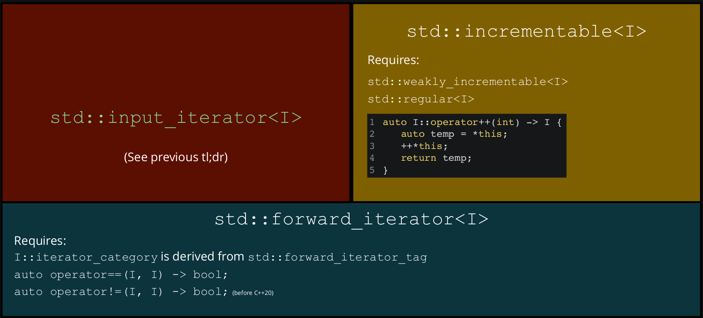

# Generic Programming

## Concepts

> *"Somewhat more formally, a **concept** is a description of requirements on one or more types stated in terms of the existence and properties of procedures, type attributes, and type functions defined on the types."* - Elements of Programming, by Alexander Stepanov and Paul McJones

**Concepts** are essentially a way we describe requirements on types. We use the requirements to describe properties for our algorithms; e.g. syntax requirements, semantic requirements, complexity requirements.

A **constraint** is a syntax requirement. The compiler can check these.

An **axiom** is a semantic requirement. The compiler can't check these, but librarians may assume that they hold **true** forever. Pre-condition (and post-condition) checks can sometimes check at runtime.  
Axioms are usually provided via comments in-tandem with the constraints.

**Complexity requirements** don't have a fancy name, and can't be checked by the implementation, nor the library author. A sophisticated [benchmarking tool](https://github.com/google/benchmark/#asymptotic-complexity) might be able to do so.

We say that a type *satisfies* the requirements if all the constraints evaluate as true. We say a type *models* the concept if, and only if, it satisfies the requirements and meets the axioms and complexity requirements.

### Concepts in C++

You can think of concepts as a predicate that understand how to work with types:

``` cpp
template<typename T>
concept type = true; // syntax: concept concept_name = predicate;

template<typename T>
requires type<T> // require that the T satisfies predicate 'type'
void hello(T) {
    std::cout << "Permissive, base-case\n";
}

int main() {
    hello(0);
    hello(0.0);
    hello("base-case");
}
```

is equivalent to:

``` cpp
template<typename T> // deduce the type and check
concept type = true; // the constraints are satisfied

template<type T> // same as using `typename` right now
void hello(T) {
    std::cout << "Permissive, base-case\n";
}

int main() {
    hello(0);
    hello(0.0);
    hello("base-case");
}
```

Concepts with *actual* constraints:

``` cpp
template<typename T>
concept integral = std::is_integral_v<T>; // return true for integers, otherwise false

// must pass in an integral type to call hello()
template<integral T>
void hello(T) {
    std::cout << "Integral case\n";
}

int main() {
    hello(0);
    //hello(0.0);         // won't compile
    //hello("base-case"); // won't compile
}
```

``` cpp
template<typename T>
concept floating_point = std::is_floating_point_v<T>;

void hello(floating_point auto f) {
    std::cout << "Floating-point case\n";
}

int main() {
    // hello(0);          // won't compile
    hello(0.0);
    //hello("base-case"); // won't compile
}
```

Assuming all our concepts have been defined, we can do the following:

``` cpp
#include <iostream>
#include <type_traits>

template<typename T>
concept integral = std::is_integral_v<T>;

template<typename T>
concept floating_point = std::is_floating_point_v<T>;

void hello(integral auto)       { std::cout << "Integral case\n";       }
void hello(floating_point auto) { std::cout << "Floating-point case\n"; }
void hello(auto)                { std::cout << "Base-case\n";           }

int main() {
    hello(0);           // prints "Integral case"
    hello(0.0);         // prints "Floating-point case"
    hello("base case"); // prints "Base-case"
}
```

### Refining and Weakening Concepts

A concept C2 ***refines*** a concept C1, if whenever C2 is modelled, C1 is also modelled (i.e. satisfies constraints, axioms and complexity requirements). You can think of it as C2's properties being a superset of C1's; it extends C1's properties.  
A concept C2 ***weakens*** a concept C1, if its requirements are a proper subset of C1.

``` cpp
#include <iostream>
#include <type_traits>

template<typename T>
concept integral = std::is_integral_v<T>;

void hello(integral auto) { std::cout << "Integral case\n"; }

template<typename T>
concept signed_integral = integral<T> and std::is_signed_v<T>; // refines integral, has all the
                                                               // properties of integral and more

void hello(signed_integral auto) { std::cout << "Signed integral case\n"; }

int main() {
    hello(0); // prints "Signed integral case"
    hello(0U); // prints "Integral case"
}
```

### Library Concepts

C++20 introduced concepts as a language feature, along with three families of highly usable concepts.

Due to many reasons they are available in GCC 10 and recent versions of MSVC but not Clang with `libc++`.

There is a 1:1 mapping between concepts in range-v1 and what's in the standard library.

| Concepts family | Relevant header | `CMakeLists` `LINK` | Namespace |
| ---             | ---             | ---                 | ---       |
| [Concepts library](https://en.cppreference.com/w/cpp/concepts)   | `<concepts/concepts.hpp>` | `concepts::concepts` | `concepts` |
| [Iterators library](https://en.cppreference.com/w/cpp/iterators) | `<range/v3/iterator.hpp>` | `range-v3`           | `ranges`   |
| [Ranges library](https://en.cppreference.com/w/cpp/ranges)       | `<range/v3/range.hpp>`    | `range-v3`           | `ranges`   |

### Why Concepts?

With normal templates, errors are not particularly readable/easily understood:

``` cpp
struct equal_to {
    template<typename T, typename U>
    auto operator()(T const& t, U const& u) const -> bool {
        return t == u;
    }
};

auto main() -> void {
    equal_to{}(0, 0);                           // okay, returns true
    equal_to{}(std::vector{0}, std::vector{1}); // okay, returns false
    equal_to{}(0, 0.0);                         // okay, returns true
    equal_to{}(0.0, 0);                         // okay, returns true
    equal_to{}(0, std::vector<int>{});          // error: `int == vector` not defined
}
```

With concepts, the errors make more sense:

``` cpp
struct equal_to {
    template<typename T, std::equality_comparable_with<T> U>
    // U must be comparable with T
    auto operator()(T const& t, U const& u) const -> bool {
        return t == u;
    }
};

auto main() -> void {
    equal_to{}(0, 0);                           // okay, returns true
    equal_to{}(std::vector{0}, std::vector{1}); // okay, returns false
    equal_to{}(0, 0.0);                         // okay, returns true
    equal_to{}(0.0, 0);                         // okay, returns true
    equal_to{}(0, std::vector<int>{});          // still error, but makes more sense
}
```

### Regularity

``` cpp
template<typename T>
concept movable = std::is_object_v<T>
              and std::move_constructible<T>
              and std::assignable_from<T&, T> // move assignable
              and std::swappable<T>;

template<typename T>
concept copyable = std::copy_constructible<T>
               and std::movable<T>
               and std::assignable_from<T&, T const&>; // copy assignable; T const& is the parameter
                                                       // T& is the object being assigned

template<typename T>
concept semiregular = std::copyable<T> and std::default_initializable<T>;

template<typename T>
concept regular = std::semiregular<T> and sts::equality_comparable<T>;
// equality_comparable => comparable with objects of the same type
```

## Iterators

Iterators allow us to generic algorithms that can work on many data structures; e.g. a generic find:

``` cpp
auto const v = std::deque<int>{0, 1, 2, 3, 4, 5, 6, 7, 8, 9};
auto result = ranges::find(v.begin(), v.end(), 6);
if (result != v.end()) {
    std::cout << "Found 6\n";
} else {
    std::cout << "Didn't find 6.\n";
}
```

### Iterator Invalidation

An **iterator** is an abstract notion of a **pointer**. When we modify a container we are iterating through, iterators may be invalidated. Using an invalid iterator results in undefined behaviour.

Invalidation for [`push_back`](https://en.cppreference.com/w/cpp/container/vector/push_back):  
Think about the way a vector is stored. "If the new `size()` is greater than `capacity()` then all iterators and references (including the past-the-end iterator) are invalidated. Otherwise only the past-the-end iterator is invalidated."

``` cpp
auto v = std::vector<int>{1, 2, 3, 4, 5};

// Copy all 2s
for (auto it = v.begin(); it != v.end(); ++i) {
    if (*it == 2) {
        v.push_back(2);
    }
}
```

Invalidation for [`erase`](https://en.cppreference.com/w/cpp/container/vector/erase):  
"Invalidates iterators and references at or after the point of erase, including the `end()` iterator". For this reason, erase returns a new iterator.

``` cpp
auto v = std::vector<int>{1, 2, 3, 4, 5};

// Erase all even numbers
for (auto it = v.begin(); it != v.end(); ) {
    if (*it % 2 == 0) {
        it = v.erase(it);
    } else {
        ++it;
    }
}
```

Containers generally don't invalidate when you modify values, but they may invalidate when removing are adding elements.

* `std::vector` invalidates everything when adding elements (your iterators, pointers and references)
* `std::unordered_(map|set)` invalidates all iterators when adding elements; pointers and references will be safe
* `std::map` and `std::set` don't invalidated iterators upon insertion, only removed iterators are invalidated.

### Iterator Adaptors

There are two types of iterator adaptors:

* a wrapper around a type to ***grant that that iterator properties***
* a wrapper around an iterator type to ***grant additional or different iterator properties***

E.g. `std::reverse_iterator` is an iterator adaptor that transforms an existing iterator's `operator++` to mean "move backward" and `operator--` to mean "move forward".

``` cpp
std::reverse_iterator<std::vector<int>::iterator>
```

### Readable iterators

| Operation      | Array-like                | Node-based    | Iterator    |
| ---            | ---                       | ---           | ---         |
| Iteration type | `gsl_lite::index`         | `node*`       | unspecified |
| Read element   | `v[i]`                    | `i->value`    | `*i`        |
| Successor      | `j = i + n < ranges::distance(v) ? i + n : ranges::distance(v)` | `j = i->successor(n)` | `ranges::next(i, s, n)` |
| Advance fwd    | `++i`                     | `i = i->next` | `++i`       |
| Comparison     | `i < ranges::distance(v)` | `i != nullptr`| `i != s`    |

#### Indirectly Readable

An object is indirectly readable if we are able to read it through another object.

A type `I` models the concept `std::indirectly_readable` if:

1. These types exist
    * `std::iter_value_t<I>` - a type we can create an lvalue from
    * `std::iter_reference_t<I>` - the type `I::operator*` returns
    * `std::iter_rvalue_reference_t<I>` - the type `ranges::iter_move(i)` returns  
    `ranges::iter_move(i)` is approximately `std::move(*i)`
2. These type pairs share a "relationship"
    * `std::iter_reference_t<I>` and `std::iter_value_t<I>&`
    * `std::iter_reference_t<I>` and `std::iter_rvalue_reference_t<I>`
    * `std::iter_rvalue_reference_t<I>` and `std::iter_value_t<I> const&`
3. Given an object `i` of type `I`, `*i` outputs the same thing when called with the same input

Generating `iter_` types for a doubly linked list:

``` cpp
template<typename T>
class linked_list {
public:
    class iterator;
private:
    struct node {
        T value;
        std::unique_ptr<T> next; // owns its successor
        T* prev;                 // observer to predecessor
    };
    std::unique_ptr<node> n;
};
```

``` cpp
template<typename T>
class linked_list<T>::iterator {
public:
    using value_type = T; // std::iter_value_t<iterator> is value_type

    auto operator*() const noexcept -> value_type const& {
        // iter_reference_t<iterator> is value_type&
        // iter_rvalue_reference<iterator> is value_type&&
        return pointee_->value;
    }
private:
    node* pointee_;

    friend class linked_list<T>;

    explicit iterator(node* pointee)
    : pointee_(pointee) {}
};

// static_assert is just an assert run at compile time
static_assert(std::indirectly_readable<linked_list<int>::iterator>);
```

See more on `indirectly_readable` at [cppreference](https://en.cppreference.com/w/cpp/iterator/indirectly_readable)  
See more on `iter_` at [cppreference](https://en.cppreference.com/w/cpp/iterator/iter_t)

#### Weakly Incrementable

A type `I` models the concept `std::weakly_incrementable` if:

1. `I` models `std::default_initializable` and `std::moveable`
2. `std::iter_difference_t<I>` exists and is a signed integer

Let `i` be an object of type `I`

1. `++i` is valid and returns a reference to itself
2. `i++` is valid and has the same domain as `++i`
3. `++i` and `i++` both advance `i`, with constant time complexity

Generating `std::iter_difference_t<I>`:

``` cpp
template<typename T>
class linked_list<T>::iterator {
public:
    using value_type = T;
    using difference_type = std::ptrdiff_t; // std::iter_difference_t<iterator> is difference_type

    iterator() = default; // default constructor

    auto operator*() const noexcept -> value_type const& { /* ... */ }

    auto operator++() -> iterator& {
        pointee_ = pointee_->next.get();
        return *this;
    }
    auto operator++(int) -> void { ++*this; } // doesn't return a copy because copying is not defined yet
private:
    //...
};

static_assert(std::weakly_incrementable<linked_list<int>::iterator>);
```

See more on `weakly_incrementable` at [cppreference](https://en.cppreference.com/w/cpp/iterator/weakly_incrementable)

#### Iterator Basis

`std::input_or_output_iterator` is the root concept for all six iterator categories.

A type `I` models the concept `std::input_or_output_iterator` if:

1. `I` models `std::weakly_incrementable`
2. `*i` is a valid expression and returns a reference to an object

See more on `input_or_output_iterator` at [cppreference](https://en.cppreference.com/w/cpp/iterator/input_or_output_iterator)

#### Input Iterators

`std::input_iterator` describes the requirement for an iterator that can be read from.

A type `I` models the concept `std::input_iterator` if:

1. `I` models `std::input_or_output_iterator`
2. `I` models `std::indirectly_readable`
3. `I::iterator_category` is a type alias derived from `std::input_iterator_tag`

Input iterators let us write a generic find (see complete implementation at [sentinels](#sentinels)):

``` cpp
template<std::input_iterator I, typename T>
// std::indirect_binary_predicate checks ranges::equal_to{}(*first, *&value) is possible
// This is how we check *first == value is valid
requires std::indirect_binary_predicate<ranges::equal_to, I, T const*>
auto find(I first, I last, T const& value) -> I {
    for (; first != last; ++first) {
        if (*first == value) {
            return first;
        }
    }
    return last;
}
```

Modelling `std::input_iterator`:

``` cpp
template<typename T>
class linked_list<T>::iterator {
public:
    using value_type = T;
    using difference_type = std::ptrdiff_t;
    using iterator_category = std::input_iterator_tag; // iterator_category is a type that is derived from input_iterator _tag
                                                       // "any type is derived from itself"

    iterator() = default;

    auto operator*() const noexcept -> value_type const& { ... }

    auto operator++() -> iterator& { ... }
    auto operator++(int) -> void { ++*this; }
private:
    //...
};

static_assert(std::input_iterator<linked_list<int>::iterator>);
```

See more on `std::input_iterator` at [cppreference](https://en.cppreference.com/w/cpp/iterator/input_iterator)

#### Readable Iterators TL;DR


### Sentinels

Consider the counted iterators below:

``` cpp
// We leverage this through range-v3 in 20T2
// (it's available as std:: in GCC 10)
template<std::input_iterator I>
counted_iterator<I>::counted_iterator(I first, std::iter_difference_t<I> n);
std::ranges::find(std::counted_iterator{first, 10},
                  std::counted_iterator<int>(), // well, that's a bit weird
                  value)
```

It's weird because we are giving meaning to an arbitrary value, and it doesn't really express intentions to the reader.  
It's also limiting, because we can't express any additional information. What if we wanted to also stop on the first even `int`.

A **sentinel** is a type that denotes the end of a range. It might be an iterator of the same type (like with containers), or it might be a completely different type.

Type `S` and `I` model the concept `std::sentinel_for<S, I>`, where `S` is a sentinel for `I` if:

1. `I` models `std::input_or_output_iterator`
2. `S` models `std::semiregular`

Let `i` be an object of type `I` and `s` be an object of type `S`

1. `i == s` is well-defined (i.e. it return `bool` and we have the other three)
2. If `i != s` is true, then `i` is dereference-able

See more on `sentinel_for` at [cppreference](https://en.cppreference.com/w/cpp/iterator/sentinel_for)

The [**default sentinel**](https://en.cppreference.com/w/cpp/iterator/default_sentinel_t) is type-based; a way of deferring the comparison rule to the iterator when there's no meaningful definition for an end value.

``` cpp
std::ranges::find(std::counted_iterator(first, 10),
                  std::default_sentinel,
                  value);

template<std::input_iterator I>
auto counted_iterator<I>::operator==(std::default_sentinel) const -> bool {
    return n_ == 0;
}
```

The [**unreachable sentinel**](https://en.cppreference.com/w/cpp/iterator/unreachable_sentinel_t) is a way of saying "there is no end to this range".

``` cpp
struct unreachable_sentinel_t {
    template<std::weakly_incrementable I>
    friend constexpr bool operator==(unreachable_sentinel_t, I const&) noexcept {
        return false;
    }
}
```

Completing out implementation of `find`:

``` cpp
template<std::input_iterator I, std::sentinel_for<I> S, typename T>
requires std::indirect_binary_predicate<ranges::equal_to, I, T const*>
auto find(I first, S last, T const& value) -> I {
    for (; first != last; ++first) {
        if (*first == value) {
            return first;
        }
    }
    return first;
}
```

### Relationship Between Iterators and Ranges

Let's say there's an object `r` of type `R`

#### `std::ranges::begin`

``` cpp
template<typename R>
std::input_or_output_iterator auto std::ranges::being(R& r);
```

* returns an object that models `std::input_or_output_iterator`
* works on lvalues and sometimes on rvalues
* works on types that use `r.begin()` (e.g. `std::vector`)
* works on types that use `begin(r)` without needing to do the following in every scope:

    ``` cpp
    using std::begin;
    auto a = begin(r);
    // Example usage:
    auto i = std::ranges::begin(r);
    ```

`std::iterator_t<R>` is defined as the deduced return type for `std::ranges::begin(r)`

See more on `std::ranges::begin` at [cppreference](https://en.cppreference.com/w/cpp/ranges/begin)

#### `std::ranges::end`

``` cpp
template<typename R>
std::sentinel_for<std::ranges::iterator_t<R>> auto std::ranges::end(R&& r);
```

* return an object that models `std::sentinel_for<std::iterator_t<R>>`
* works on lvalues and sometimes rvalues
* works on types that use `r.end()` (e.g. `std::vector`)
* works on types that use `end(r)` without needing to do the following in every scope:

    ``` cpp
    using std::end;
    auto a = end(r);
    // Example usage
    auto i = std::ranges::end(r);
    ```

`std::sentinel_t<R>` is defined as the deduced return type for `std::ranges::end(r)`

See more on `std::ranges::end` at [cppreference](https://en.cppreference.com/w/cpp/ranges/range)

#### `std::ranges:range`

`R` models the concept `range` when:

* `R` is a valid type parameter for both `std::ranges::begin` and `std::ranges::end`
* `ranges::begin(r)` returns an iterator in amortised `O(1)` time
* `ranges::end(r)` returns a sentinel in amortised `O(1)` time
* `[ranges::being(r), ranges::end(r))` denotes a valid range (i.e. there's a finite number of iterations between the two)

``` cpp
template<typename T>
concept range = requires(R& r) {
    std::ranges::begin(r); // returns an iterator
    std::ranges::end(r);   // returns a sentinel for that iterator
}
```

Note: `std::ranges::begin(r)` is not required to return the same result on each call

See more on `std::ranges::range` at [cppreference](https://en.cppreference.com/w/cpp/ranges/range)

#### `std::ranges::input_range`

`input_range` refines `range` to make sure `ranges::being(r)` returns an input iterator

``` cpp
template<typename T>
concept input_range = std::ranges::range<T> and std::input_iterator<std::ranges::iterator_t<T>>;
```

#### Range-Based Find

``` cpp
template<ranges::input_range R, typename T>
requires std::indirect_binary_predicate<ranges::equal_to,
                                        ranges::iterator_t<R>,
                                        const T*>

auto find(R&& r, T const& value) -> ranges::borrowed_iterator_t<R> {
    return comp6771::find(ranges::begin(r), ranges::end(r), value);
}
```

The range-based `find` defers to the iterator-based `find`. We prefer this algorithm when we need both begin and end, as opposed to arbitrary iterators, so that we don't mix iterators up and create invalid ranges (it's also more readable).

`ranges::borrowed_iterator_t<R>` is the same as `ranges::iterator_t<R>` if `R` is an l value reference or a reference to a borrowed range (not discussed), and a non-iterator otherwise

``` cpp
auto v = std::vector<int>{0, 1, 2, 3};
ranges::find(v, 2);                   // returns an iterator
ranges::find(views::iota(0, 100), 2); // returns an iterator

ranges::find(std::vector<int>[0, 1, 2, 3], 2) // returns ranges::dangling which is more useful
                                              // than void (better compile time diagnostic info)
```

Turning out doubly linked list into a range:

``` cpp
template<typename T>
class linked_list {
public:
    class iterator;

    auto begin() const -> iterator { return head_; }
    auto end() const -> iterator { return tail_; }
private:
    struct node {
        T value;
        std::unique_ptr<node> next;
        node *prev;
    };

    std::unique_ptr<node> head_;
    node* tail;
};
```

#### Incrementable

We can implement `find_last` as follows:

``` cpp
template<std::input_iterator I, std::sentinel_for<I> S, class Val>
requires std::indirect_relation<ranges::equal_to, I, Val const*>
auto find_last(I first, S last, Val const& value) -> I {
    auto cache = std::optional<I>();
    for (; first != last; ++first) {
        if (*first == value) {
            cache = first;
        }
    }
    return cache.value_or(std::move(first));
}
```

`I` isn't guaranteed to model `std::copyable`. Even if it were, `I` is only guaranteed to work for a single pass.

`std::incrementable` refines `std::weakly_incrementable` so that you can copy and iterable over the same sequence of values multiple times.

A type `I` models the concept `std::incrementable` if:

1. `I` models `std::weakly_incrementable`
2. `I` models `std::regular`
3. `i++` is equivalent to

    ``` cpp
    auto I::operator++(int) -> I {
        auto temp = i;
        ++i;
        return temp;
    }
    ```

Modelling `std::incrementable<I>`:

``` cpp
template<typename T>
class linked_list<T>::iterator {
public:
    using value_type = T;
    using difference_type = std::ptrdiff_t;
    using iterator_category = std::input_iterator_tag;

    iterator() = default;

    auto operator*() const noexcept -> value_type const& { ... }

    auto operator++() -> iterator& { ... }
    // post-increment can now return an iterator instead of void
    auto operator++(int) -> iterator {
        auto temp = *this;
        ++*this;
        return temp;
    }
private:
    //...
};

static_assert(std::incrementable<linked_list<int>::iterator>);
```

See more on `incrementable` at [cppreference](https://en.cppreference.com/w/cpp/iterator/incrementable)

#### Forward Iterators

`std::forward_iterator` refines input iterators so you can copy and iterate over the same sequence of values multiple time.

A type `I` models the concept `std::forward_iterator` if:

1. `I` models `std::input_iterator`
2. `I` models `std::incrementable`
3. `I::iterator_category` is derived from [`std::forward_iterator_tag`](http://en.cppreference.com/w/cpp/iterator/iterator_tags)
4. `I` can be its own sentinel

Modelling `std::forward_iterator`:

``` cpp
template<typename T>
class linked_list<T>::iterator {
public:
    using value_type = T;
    using difference_type = std::ptrdiff_t;
    using iterator_category = std::forward_iterator_tag; // refine the iterator category

    iterator() = default;

    auto operator*() const noexcept -> value_type& { ... }

    auto operator++() -> iterator& { ... }
    auto operator++(int) -> iterator { ... }

    // add equality operator
    auto operator==(iterator, iterator) const -> bool = default;
private:
    //...
};

static_assert(std::forward_iterator<linked_list<int>::iterator>);
```

Our `find_last` becomes:

``` cpp
template<std::forward_iterator I, std::sentinel_for<I> S, class Val>
requires std::indirect_relation<ranges::equal_to, I, Val const*>
auto find_last(I first, S last, Val const& value) -> I {
    auto cache = std::optional<I>();
    for (; first != lastl ++first) {
        if (*first == value) {
            cache = first;
        }
    }
    return cache.value_or(std::move(first));
}
```

See more on `forward_iterator` at [cppreference](https://en.cppreference.com/w/cpp/iterator/forward_iterator)

#### Forward Range

`forward_range` refines `input_range` to make sure `ranges::begin(r)` returns a forward iterator.  
`ranges::begin(r)` now returns the same value given the same input.

``` cpp
template<typename T>
concept forward_range = std::ranges::input_range<T> and std::forward_iterator<std::ranges::iterator_t<T>>;
```

#### Ranges TL;DR


