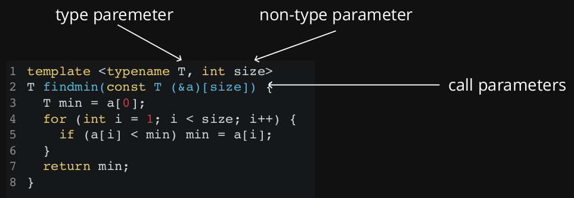

# Advanced Templates

## Default Members

We can provide default arguments to template types (where the default themselves are types). It means we have to update all of our template parameter lists.

``` cpp
// demo801-default.h
#include <vector>

template<typename T, typename CONT = std::vector<T>>
class stack {
    public:
    stack();
    ~stack();
    auto push(T&) -> void;
    auto pop() -> void;
    auto top() -> T&;
    auto top() const -> const T&;
private:
    CONT stack_;
};

template<typename T, typename CONT>
int stack<T, CONT>::num_stacks_ = 0;

template<typename T, typename CONT>
stack<T, CONT>::stack() {
    num_stacks_++;
}

template<typename T, typename CONT>
stack<T, CONT>::~stack() {
    num_stacks_--;
}
```

``` cpp
#include <iostream>

#include "demo801-default.h"

auto main() -> int {
    stack<float> fs;
    stack<int< is1, is2, is3;
    std::cout << stack<float>::num_stacks_ << "\n";
    std::cout << stack<int>::num_stacks_ << "\n";
}
```

## Specialisation

The templates we've defined so far are completely generic. There are two ways we can redefine our generic types for something more specific:

* [partial specialisation](https://en.cppreference.com/w/cpp/language/partial_specialization) - describing the template for another form of the template; e.g.  `T*` or `std::vector<T>`
* [explicit specialisation](https://www.google.com/url?sa=t&rct=j&q=&esrc=s&source=web&cd=1&cad=rja&uact=8&ved=2ahUKEwiji5KH9sXjAhXl63MBHQESC7IQFjAAegQIAxAB&url=https%3A%2F%2Fen.cppreference.com%2Fw%2Fcpp%2Flanguage%2Ftemplate_specialization&usg=AOvVaw0dcNLzVTcNsLH21MlHHQyH) - describing the template for a specific, non-generic type; e.g. `std::string` or `int`

When to specialise:

* You need to preserve existing semantics for something that would not otherwise work  
`std::is_pointer` is partially specialised over pointers
* You want to write a type trait  
`std::is_integral` is fully specialised for `int`, `long` etc.
* There is an optimisation you can make for a specific type  
`std::vector<bool>` is fully specialised to reduce memory footprint

When **not** to specialise:

* **Don't specialise functions**
    * A function cannot be partially specialised
    * Fully specialised functions are better done with overloads
    * See Herb Sutter's [article](www.gotw.ca/publications/mill17.htm)
* You think it would be cool if you changes some feature of the class for a specific type
    * People assume a class works the same for all types
    * **Don't violate assumptions**

Here we have a stack template class:

``` cpp
// stack.h
#include <vector>
#include <iostream>
#include <numeric>

template <typename T>
class stack {
public:
    auto push(T t) -> void { stack_.push_back(t); }
    auto top() -> T& { return stack_.back(); }
    auto pop() -> void { stack_.pop_back(); }
    auto size() const -> int { return stack_.size(); };
    auto sum() -> int {
        return std::accumulate(stack_.begin(), stack_.end(), 0);
    }
private:
    std::vector<T> stack_;
};
```

``` cpp
// stack_main.cpp
auto main() -> int {
    int i1 = 6771;
    int i2 = 1917;

    stack<int> s1;
    s1.push(i1);
    s1.push(i2);
    std::cout << s1.size() << " ";
    std::cout << s1.top() << " ";
    std::cout << s1.sum() << "\n";
}
```

### Partial Specialisation

In this case, we will specialise for pointer types.

You can partially specialise classes, but you cannot partially specialise a particular function of a class in isolation.

The following is a fairly standard example, for illustration purposes only. Specialisation is designed to refine a generic implementation for a specific type, not to change the semantic.

``` cpp
// demo802-partial.h
template <typename T>
class stack<T*> {
public:
    auto push(T* t) -> void { stack_.push_back(t); }
    auto top() -> T* { return stack_.back(); }
    auto pop() -> void { stack_.pop_back(); }
    auto size() const -> int { return stack_.size(); };
    auto sum() -> int{
    return std::accumulate(stack_.begin(),
        stack_.end(), 0, [] (int a, T *b) { return a + *b; });
    }
private:
    std::vector<T*> stack_;
};
```

``` cpp
// demo802-partial.cpp
auto main() -> int {
    int i1 = 6771;
    int i2 = 1917;

    stack<int*> s2;
    s2.push(i1);
    s2.push(i2);
    std::cout << s2.size() << " ";
    std::cout << s2.top() << " ";
    std::cout << s2.sum() << "\n";
}
```

### Explicit Specialisation

Explicit specialisation should only be done on classes. `std::vector<bool>` is an interesting example; see [here](http://www.gotw.ca/publications/mill09.htm) and [here](https://stackoverflow.com/questions/17794569/why-is-vectorbool-not-a-stl-container). `std::vector<bool>::reference` is not a `bool&`

``` cpp
#include <iostream>
template <typename T>
struct is_void {
    static bool const val = false;
};

template<>
struct is_void<void> {
    static bool const val = true;
};

auto main() -> int {
    std::cout << is_void<int>::val << "\n";
    std::cout << is_void<void>::val << "\n";
}
```

## Type Traits

A **trait** (or [type trait](http://en.cppreference.com/w/cpp/header/type_traits)) is a class (or class template) that *characterises* a type.

``` cpp
#include <iostream>
#include <limits>

auto main() -> int {
    std::cout << std::numeric_limits<double>::min() << "\n";
    std::cout << std::numeric_limits<int>::min() << "\n";
}
```

This is what `<limits>` might look like:

``` cpp
template <template T>
struct numeric_limits {
    static auto min() -> T;
}

template <>
struct numeric_limits<int> {
    static auto min() -> int { return -INT_MAX - 1; }
}

template <>
struct numeric_limits<double> {
    static auto min() -> double { return -DBL_MAX - 1; }
}
```

Traits allow generic template functions to be parameterised:

``` cpp
#include <array>
#include <iostream>
#include <limits>

template <typename T, std::size_t size>
T findMax(const std::array<T, size>& arr) {
    T largest = std::numeric_limits<T>::min();
    for (auto const& i : arr) {
        if (i > largest) largest = i;
    }
    return largest;
}

auto main() -> int {
    std::array<int, 3> i{ -1, -2, -3 };
    std::cout << findMax<int, 3>(i) << "\n";
    std::array<double, 3> j{ 1.0, 1.1, 1.2 };
    std::cout << findMax<double, 3>(j) << "\n";
}
```

Below are STL type trait examples for a specialisation and partial specialisation.  
This is a *good* example of partial specialisation.

``` cpp
#include <iostream>

template <typename T>
struct is_void {
    static const bool val = false;
};

// explicit specialisation
template<>
struct is_void<void> {
    static const bool val = true;
};

auto main() -> int {
    std::cout << is_void<int>::val << "\n";
    std::cout << is_void<void>::val << "\n";
}
```

``` cpp
#include <iostream>

template <typename T>
struct is_pointer {
    static const bool val = false;
};

template<>
struct is_pointer<T*> {
    static const bool val = true;
};

auto main() -> int {
    std::cout << is_pointer<int*>::val << "\n";
    std::cout << is_pointer<int>::val << "\n";
}
```

Below are STL type trait examples:

``` cpp
#include <iostream>
#include <type_traits>

template <typename T>
auto testIfNumberType(T i) -> void {
    if (std::is_integral<T>::value || std::is_floating_point<T>::value) {
        std::cout << i << " is a number" << "\n";
    } else {
        std::cout << i << " is not a number" << "\n";
    }
}

auto main() -> int {
    int i = 6;
    long l = 7;
    double d = 3.14;
    testIfNumberType(i);       // 6 is a number
    testIfNumberType(l);       // 7 is a number
    testIfNumberType(d);       // 3.14 is a number
    testIfNumberType(123);     // 123 is a number
    testIfNumberType("Hello"); // Hello is not a number
    auto s = "World";
    testIfNumberType(s);       // World is not a number
}
```

## Variadic Templates

``` cpp
#include <iostream>
#include <typeinfo>

template <typename T>
auto print(const T& msg) -> void {
    std::cout << msg << " ";
}

// ... is a "parameter pack" accepting 0 or more arguments
template <typename A, typename... B>
auto print(A head, B... tail) -> void {
    print(head);
    print(tail...);
}

auto main() -> int {
    print(1, 2.0f);
    std::cout << "\n";
    print(1, 2.0f, "Hello");
    std::cout << "\n";
}
```

These are the instantiations that will have been generated when we call `print(1, 2.0f, "Hello")`

``` cpp
auto print(const char* const& c) -> void {
    std::cout << c << " ";
}

auto print(float const& b) -> void {
    std::cout << b << " ";
}

auto print(float b, const char* c) -> void {
    print(b);
    print(c);
}

auto print(int const& a) -> void {
    std::cout << a << " ";
}

auto print(int a, float b, const char* c) -> v
    print(a);
    print(b, c);
}
```

## Member Templates

Sometimes templates can be too rigid for our liking.  
The following code *could* work, but doesn't by default

``` cpp
#include <vector>

template <typename T>
class stack {
public:
    auto push(T& t) -> void { stack._push_back(t); }
    auto top() -> T& { return stack_.back(); }
private:
    std::vector<T> stack_;
};

auto main() -> int {
    stack<int> is1;
    is1.push(2);
    is1.push(3);
    stack<int> is2{is1}; // this works
    stack<double> ds1{is1}; // this does not
}
```

Through the use of member templates, we can extend capabilities.

``` cpp
// demo809-membertemp.cpp
#include <vector>

template <typename T>
class stack {
public:
    explicit stack() {}
    template <typename T2>
    stack(stack<T2>&);
    auto push(T t) -> void { stack_.push_back(t); }
    auto pop() -> T;
    auto empty() const -> bool { return stack_.empty(); }
private:
    std::vector<T> stack_;
};

template <typename T>
T stack<T>::pop() {
    T t = stack_.back();
    stack_.pop_back();
    return t;
}

template <typename T>
template <typename T2>
stack<T>::stack(stack<T2>& s) {
    while (!s.empty()) {
        stack_.push_back(static_cast<T>(s.pop()));
    }
}
```

``` cpp
auto main() -> int {
    stack<int> is1;
    is1.push(2);
    is1.push(3);
    stack<int> is2{is1}; // this works
    stack<double> ds1{is1}; // this works
}
```

## Template Template Parameters

Previously, when we wanted to have a Stack with a templated container type, we had to do the following:

``` cpp
#include <iostream>
#include <vector>

auto main() -> int {
    stack<int, std::vector<int>> s1;
    s1.push(1);
    s1.push(2);
    std::cout << "s1: " << s1 << "\n";

    stack<float, std::vector<float>> s1;
    s1.push(1.1);
    s1.push(2.2);
    std::cout << "s2: " << s2 << "\n";

    // issues arise when we do:
    // stack<float, std::vector<int>> s3
}
```

Ideally, we can just do:

``` cpp
#include <iostream>
#include <vector>

auto main() -> int {
    stack<int, std::vector> s1;
    s1.push(1);
    s1.push(2);
    std::cout << "s1: " << s1 << "\n";

    stack<float, std::vector> s1;
    s1.push(1.1);
    s1.push(2.2);
    std::cout << "s2: " << s2 << "\n";
}
```

To do this, we just need:

``` cpp
template <typename T, template <typename> typename CONT>
class stack {}
```

Example:

``` cpp
#include <iostream>
#include <memory>
#include <vector>

template<typename T, template<typename...> typename CONT>
class stack {
public:
    auto push(T t) -> void {
        stack_.push_back(t);
    }
    auto pop() -> void {
        stack_.pop_back();
    }
    auto top() -> T& {
        return stack_.back();
    }
    auto empty() const -> bool {
        return stack_.empty();
    }
private:
    CONT<T> stack_;
};

#include <iostream>
#include <vector>

auto main(void) -> int {
    stack<int, std::vector> s1;
    s1.push(1);
    s1.push(2);
}
```

## Template Argument Deduction

**Template argument deducation** is the process of determining the types (of **type parameters**) and the values of **non-type parameters** from the types of **function arguments**



### Implicit Deduction

**Non-type parameters**: implicit conversions behave just like normal type conversions
**Type parameters**: three possible implicit conversions; others as well, that we won't go into.

``` cpp
// array to pointer
f(T* array) {}

int a[] = {1, 2};
f(a);
```

``` cpp
// const qualification
template <typename T>
f(T const item) {}

int a = 5;
f(a); // int -> const int
```

``` cpp
// conversion to base class from derived class
template <typename T>
void f(base<T>& a) {}

template <typename T>
class derived : public base<T> {}; // derived inherits base<T>
derived<int> d;
f(d);
```

### Explicit Deduction

If we need more control over the normal deduction process, we can explicitly specify the types being passed in.

``` cpp
template <typename T>
T min(T a, T b) {
    return a < b ? a : b;
}

auto main() -> {
    int i;
    double d;
    min(i, static_cast<int>(d));    // int min(int, int)
    min<int>(i, d);                 // int min(int, int)
    min(static_cast<double>(i), d); // double min(double, double)
    min<double(i, d);               // double min(double, double)
    // min(i, d);                   // error conflicting types
}
```
