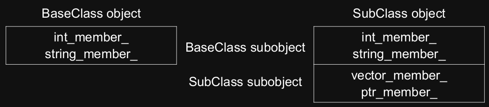
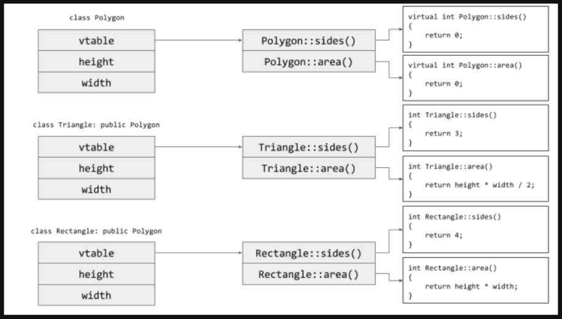

# Runtime Polymorphism

## Introduction

Key concepts:

* **Inheritance**: the ability to create new classes based on existing ones
    * Supported by class derivations
* **Polymorphism**: allows objects of a subclass to be used as if they were objects of the base class
    * Supported via virtual functions
* **Dynamic binding**: run-time resolution of the appropriate function to invoke based on the type of the object
    * Closely related to polymorphism
    * Supported via virtual functions

We can represent these ideas with classes.  
We can represent relations with inheritance or composition:

* **Inheritance**: A is also a B, and can do everything B does. It is an **"is a"** relationship; e.g. a dog ***is a*** animal
* **Composition** (data member): A contains B, but isn't a B itself. It is a **"has a"** relationship; e.g. a person ***has a*** name

Be sure to choose the right one!

### Protected Members

`protected` is a keyword we can use instead of `public`/`private`  
`protected` members are accessible only to the class, or any subclass of it

## Inheritance in C++

To inherit off classes in C++, we use:

``` cpp
class DerivedClass: public BaseClass {};
                  //  ^ visibility
```

Visibility can be one of:

* `public` - generally use this unless you have a good reason not to. If you don't want `public`, you should (usually) us composition
* `protected`
* `private`

Visibility is the maximum visibility allowed. If you specify `: private BaseClass`, then the maximum visibility is private; any `BaseClass` members that were public or protected are now private

### Tenets of C++

Don't pay for what you don't use:

* C++ supports OOP - no runtime performance penalty
* C++ supports generic programming with the STL and template - no runtime performance penalty
* Polymorphism is extremely powerful, and we need it in C++  
Do we need polymorphism at all when using inheritance?
    * Answer: sometimes  
    But how do we do so, considering that we don't want to make anyone who doesn't use it pay a performance penalty

### Inheritance and Memory Layout

Consider we have the following classes:

``` cpp
class BaseClass {
public:
    int get_int_member() { return int_member_; }
    std::string get_class_name() {
        return "BaseClass"
    };

private:
    int int_member_;
    std::string string_member_;
};

class SubClass: public BaseClass {
public:
    std::string get_class_name() {
        return "SubClass";
    }

private:
    std::vector<int> vector_member_;
    std::unique_ptr<int> ptr_member_;
};
```

In memory, the subclass contains everything in the base class and its own things:



### Inheritance and Constructors

Every subclass constructor **must** call a base class constructor. If none is manually called, the default constructor is used.

A subclass cannot initialise fields defined in the base class.

Abstract classes must have constructors

``` cpp
class BaseClass {
public:
    BaseClass(int member): int_member_{member} {}
private:
    int int_member_;
    std::string string_member_;
};

class SubClass: public BaseClass {
public:
    SubClass(int member, std::unique_ptr<int>&& ptr)
    : BaseClass{member}
    , ptr_member_{std::move(ptr)} {}

    // Won't compile.
    // SubClass(int member, std::unique_ptr<int>&& ptr)
    // : int_member_{member}
    // , ptr_member_{std::move(ptr)} {}

private:
    std::vector<int> vector_member_;
    std::unique_ptr<int> ptr_member_;
};
```

## Polymorphism

### Polymorphism and Values

We have the following:

``` cpp
class BaseClass {
public:
    int get_member() { return member_; }
    std::string get_class_name() {
        return "BaseClass";
    }

private:
    int member_;
};

class SubClass: public BaseClass {
public:
    std::string get_class_name() {
        return "SubClass";
    }
private:
    int subclass_data_;
};

void print_class_name(BaseClass base) {
    std::cout << base.get_class_name()
              << ' ' << base.get_member()
              << '\n';
}

int main() {
    BaseClass base_class;
    SubClass subclass;
    print_class_name(base_class); // print "BaseClass"
    print_class_name(subclass);   // print "BaseClass"
}
```

When we pass a `subclass` to `print_class_name`, which takes in a `BaseClass`, it will only will in the `BaseClass` values of the `subclass` and drops the rest of `subclass`'s values. This is known as **object slicing**.

### Polymorphism and References

If we pass in references of our classes, our object slicing problem is solved.

``` cpp
class BaseClass {
public:
    int get_member() { return member_; }
    std::string get_class_name() {
        return "BaseClass";
    }

private:
    int member_;
};

class SubClass: public BaseClass {
public:
    std::string get_class_name() {
        return "SubClass";
    }
private:
    int subclass_data_;
};

void print_class_name(BaseClass& base) {
    std::cout << base.get_class_name()
              << ' ' << base.get_member()
              << '\n';
}

int main() {
    BaseClass base_class;
    SubClass subclass;
    print_class_name(base_class); // prints "BaseClass"
    print_class_name(subclass);   // prints "BaseClass"
}
```

But now we have another problem.  
How does the compiler decide which version of `get_class_name` to call?  
When does the compiler decide this? Compile or runtime?  
How can it ensure that calling `get_member` doesn't have a similar overhead

## Virtual Functions

We can explicitly tell the compiler that `get_class_name` is a function designed to be modified by subclasses.  
We use the keyword `virtual` in the base class  
We use the keyword `override` in the subclass. It is not mandatory for derived class to override (or re-define the virtual function), in that case base class version of function is used.

``` cpp
class BaseClass {
public:
    int get_member() { return member_; }
    virtual std::string get_class_name() {
        return "BaseClass";
    }

private:
    int member_;
};

class SubClass: public BaseClass {
public:
    std::string get_class_name() override {
        return "SubClass";
    }
private:
    int subclass_data_;
};

void print_class_name(BaseClass& base) {
    std::cout << base.get_class_name()
              << ' ' << base.get_member()
              << '\n';
}

int main() {
    BaseClass base_class;
    SubClass subclass;
    print_class_name(base_class); // prints "BaseClass"
    print_class_name(subclass);   // prints "SubClass
}
```

### `override`

While `override` isn't required by the compiler when overriding a virtual function, you should **always** use it. `override` fails to compile if the function doesn't exist in the base class. This helps with:

* typos
* refactoring
* `const`/non-`const` methods
* slightly different signatures

``` cpp
class BaseClass {
public:
    int get_member() { return member_ }
    virtual std::string get_class_name() {
        return "BaseClass";
    }

private:
    int member_;
};

class SubClass: public BaseClass {
public:
    // this compiles, but is a different function to BaseClass' get_class_name
    std::string get_class_name() const {
        return "SubClass";
    }
private:
    int subclass_data_;
};
```

Overriding also works for heap objects:

``` cpp
class BaseClass {
public:
    int get_member() { return member_; }
    virtual std::string get_class_name() {
        return "BaseClass\n";
    }

    ~BaseClass() {
        std::cout << "Destructing base class\n";
    }

private:
    int member_;
};

class SubClass: public BaseClass {
public:
    std::string get_class_name() override {
        return "SubClass\n";
    }

    ~SubClass() {
        std::cout << "Destructing subclass\n";
    }

private:
    int subclass_data_;
};

int main() {
    auto subclass = static_cast<std::unique_ptr<BaseClass>>(std::make_unique<SubClass>());
    std::cout << subclass->get_class_name();
    // prints:
    // SubClass
    // Destructing base class
}
```

Notice the above code calls the destructor for `BaseClass` instead of `SubClass`. We will look into that a [destructing polymorphic objects](#destructing-polymorphic-objects)

### VTables

Each class has a vtable stored in the data segment. a **vtable** is an array of function pointers that says which definition each virtual function points to for that class.

If the vtable for a class is non-empty, then every member of that class has an additional data member that is a pointer to that vtable.

When a virtual function is called on a ***reference or pointer types***, then the program actually does the following:

1. Follow the vtable pointer to get to the table
2. Increment by an offset, which is a constant for each function
3. Follow the function pointer at `vtable[offset]` and call the function



### `final`

`final` specifies to the compiler "this is not virtual for any subclasses". If the compiler has a variable of type `SubClass&`, it now no longer needs to look it up in the vtable. This means static binding if you have a `SubClass&`, but dynamic binding for `BaseClass&`.

``` cpp
class BaseClass {
public:
    int get_member() { return member_ }
    virtual std::string get_class_name() {
        return "BaseClass";
    }

private:
    int member_;
};

class SubClass: public BaseClass {
public:
    std::string get_class_name() final { // is the final override
        return "SubClass";
    }
private:
    int subclass_data_;
};
```

It is also possible to mark classes as `final` to prevent inheritance of a class. If a class or struct is marked as final then it becomes non inheritable and it cannot be used as base class/struct. Thus, if a `final` class has virtual functions, those virtual functions cannot be overridden.

``` cpp
// Subclass can't be inherited
class SubClass final : public BaseClass {
public:
    std::string get_class_name() override {
        return "SubClass";
    }
private:
    int subclass_data_;
};
```

### Abstract Base Class

We use an **Abstract Base Class** (ABC) when we want a base class, but using the base class by itself does not make sense. E.g. a "Shape", there is no default way to draw it, if has no known sides by default.  
We might want some default behaviour and data, but need others to give it meaning. E.g. All files have a fine, but read are done other the network or from a disk.

If a class has **at least one "abstract"** (pure virtual in C++) **method**, the class is abstract and cannot be constructed. It can, however, have constructors and destructors. These provide semantics for constructing and destructing the ABC sub-object of any derived classes.

#### Pure Virtual Functions

Virtual functions are good for when yo have a default implementation that subclasses may want to override. Sometimes there is no default available. A **pure virtual** function specifies a function that a class **must** override in order to not be abstract.

``` cpp
class Shape {
    // You derived class "Circle" may forget to write this
    virtual void draw(Canvas&){}

    // Fails at link time because there is no definition
    virtual void draw(Canvas&);

    // Pure virtual function
    virtual void draw(Canvas&) = 0;
};
```

### Creating Polymorphic Object

In a language like Java, everything is a pointer. This allows for the code below to work, but in C++ this is not possible due to objects being stored inline:

``` cpp
// Java-style C++ here
// Don't do this.
auto base = std::vector<BaseClass>();
base.push_back(BaseClass{});
base.push_back(SubClass1{});
base.push_back(SubClass2{});
```

If you want to store a polymorphic object, use a pointer.

``` cpp
// Good C++ code
// But there's a potential problem here for destructing objects
auto base = std::vector<std::unique_ptr<BaseClass>>();
base.push_back(std::make_unique<BaseClass>());
base.push_back(std::make_unique<Subclass1>());
base.push_back(std::make_unique<Subclass2>());
```

### Destructing Polymorphic Objects

Recall that our heap instance of `SubClass` called the destructor for `BaseClass` when it goes out of scope in our previous example.

``` cpp
class BaseClass {
public:
    int get_member() { return member_; }
    virtual std::string get_class_name() {
        return "BaseClass\n";
    }

    ~BaseClass() {
        std::cout << "Destructing base class\n";
    }

private:
    int member_;
};

class SubClass: public BaseClass {
public:
    std::string get_class_name() override {
        return "SubClass ";
    }

    ~SubClass() {
        std::cout << "Destructing subclass\n";
    }

private:
    int subclass_data_;
};

int main() {
    auto subclass = static_cast<std::unique_ptr<BaseClass>>(std::make_unique<SubClass>());
    std::cout << subclass->get_class_name(); // prints "SubClass Destructing base class"
}
```

Whenever you write a class intended to be inherited from, **always** make your destructor virtual.  
**Remember**: when you declare a destructor, the move constructor and assignment are not synthesised.

So to fix our problem before, we make the `BaseClass` destructor virtual:

``` cpp
class BaseClass {
    BaseClass(BaseClass&&) = defaul;
    BaseClass(BaseClass&) = defaul;
    virtual ~BaseClass() = default;
};
```

***Forgetting this can be a hard bug to spot***

## Static and Dynamic Types

**Static type** is the type an object is declared as.  
**Dynamic type** is the type of the object itself.

Static means compile time, dynamic means runtime.

Due to object slicing, for an object that is not a reference or a pointer, the dynamic type is just the static type.

Some rules to help deduce object types:

1. The static type is the type the compiler sees it as
2. An object that is not a reference or a pointer, the dynamic type is just the static type
3. The dynamic type of an object is the dynamic type of the right-hand side object.

``` cpp
int main() {
    auto base_class = BaseClass();                   // static type: BaseClass, dynamic type: BaseClass
    auto subclass = SubClass();                      // static type: SubClass, dynamic type: SubClass
    auto sub_copy = subclass;                        // static type: SubClass, dynamic type: SubClass

    // The following could all be replaced with pointers
    // and have the same effect.
    const BaseClass& base_to_base{base_class};       // static type: const BaseClass&, dynamic type: BaseClass&

    // Another reason to use auto - you can't accidentally do this.
    const BaseClass& base_to_sub{subclass};          // static type: const BaseClass&, dynamic type: const SubClass&

    // Fails to compile
    const SubClass& sub_to_base{base_class};         // static type: const SubClass&, dynamic type: const BaseClass&
    const SubClass& sub_to_sub{subclass};            // static type: const SubClass&, dynamic type: const SubClass&

    // Fails to compile (even though it refers to at a sub);
    const SubClass& sub_to_base_to_sub{base_to_sub}; // static type: const SubClass&, dynamic type: const SubClass&
}
```

**Static binding** decides which function to call at compile time (based on static type)  
**Dynamic binding** decides which function to call at runtime (based on dynamic type)

C++ is:

* statically typed (types are calculated at compile time)
* static binding for non-virtual functions
* dynamic binding for virtual functions

Java is:

* statically typed
* dynamic binding

### Up-casting

Casting from a ***derived class to a base class*** is called **up-casting**. This cast is **always safe**; all dogs are animals. Because the cast is always safe, C++ allows this an an implicit cast. One of the reasons to use auto it that it avoids implicit casts.

``` cpp
auto dog = Dog();

// up-cast with references
Animal& animal = dog;

// up-cast with pointers
Animal* animal = &dog;

// What's this (hint: no an up-cast)? It's object slicing
Animal animal{dog};
```

### Down-casting

Casting from a ***base class to a derived class*** is called **down-casting**. This cast is **not safe**; not all animals are dogs.

``` cpp
auto dog = Dog();
auto cat = Cat();
Animal& animal_dog{dog}; // static type: Animal&, dynamic type: Dog&
Animal& animal_cat{cat}; // static type: Animal&, dynamic type: Cat&

// Attempt to down-cast with references
// Neither of these compile because the compiler does not
// know the dynamic types of the objects we are assigning
Dog& dog_ref{animal_dog}; // trying to assign Dog& to Dog&
Dog& dog_ref{animal_cat}; // trying to assign Cat& to Dog&
```

**How to down-cast:**  
The compiler doesn't know if an `Animal` happens to be a `Dog`. If you ***know*** it is, you can use `static_cast`. Otherwise, you can use `dynamic_cast`. `dynamic_cast`:

* throws exceptions for reference types if it doesn't match
* returns `nullptr` for pointer types if it doesn't match

Down-casting references:

``` cpp
auto dog = Dog();
auto cat = Cat();
Animal& animal_dog{dog};
Animal& animal_cat{cat};

// Attempt to down-cast with references.
Dog& dog_ref{static_cast<Dog&>(animal_dog)};
Dog& dog_ref{dynamic_cast<Dog&>(animal_dog)};
// Undefined behaviour (incorrect static cast).
Dog& dog_ref{static_cast<Dog&>(animal_cat)};
// Throws exception
Dog& dog_ref{dynamic_cast<Dog&>(animal_cat)};
```

Down-casting pointers:

``` cpp
auto dog = Dog();
auto cat = Cat();
Animal& animal_dog{dog};
Animal& animal_cat{cat};

// Attempt to down-cast with pointers.
Dog* dog_ref{static_cast<Dog*>(&animal_dog)};
Dog* dog_ref{dynamic_cast<Dog*>(&animal_dog)};
// Undefined behaviour (incorrect static cast).
Dog* dog_ref{static_cast<Dog*>(&animal_cat)};
// returns null pointer
Dog* dog_ref{dynamic_cast<Dog*>(&animal_cat)};
```

## Types of Functions

| Syntax                   | Name         | Meaning                                        |
| ---                      | ---          | ---                                            |
| `virtual void fn() = 0;` | pure virtual | Inherit interface **only**                     |
| `virtual void fn {}`     | virtual      | Inherit interface with optional implementation |
| `void fn() {}`           | non-virtual  | Inherit interface and mandatory implementation |

Note: non-virtuals can be hidden by writing a function with the same name in a subclass. **DO NOT DO THIS**.

### Covariants

**Covariants** cover what type a derived can return if it overrides a base.

If a function overrides a base, it must also return the type specified by the base. E.g. If a base specifies that it returns a `LandAnimal`, a derived also needs to return a `LandAnimal`. Every possible return type for the derived must be a valid return type for the base.

``` cpp
class Base {
    virtual LandAnimal& get_favourite_animal();
};

class Derived: public Base {
    // Fails to compile: not all animals are land animals
    Animal& get_favourite_animal() override;
    // Compiles: all land animals are land animals
    LandAnimal& get_favourite_animal() override;
    // Compiles: all dogs are land animals
    Dog& get_favourite_animal() override;
};
```

### Contravariants

**Contravariants** cover what type a derived can take in if it overrides a base.

If a function overrides a base, every possible parameter to the base must be a possible parameter for the derived.. E.g. If a base specifies that it takes in `LandAnimal`, a `LandAnimal` must always be valid input in the derived.

``` cpp
class Base {
    virtual void use_animal(LandAnimal&);
};

class Derived: public Base {
    // Compiles: all land animals are valid input (animals)
    void use_animal(Animal&) override;
    // Compiles: all land animals are valid input (land animals)
    void use_animal(LandAnimal&) override;
    // Fails to compile: not all land animals are valid input (dogs)
    void use_animal(Dog&) override;
};
```

### Default Argument and Virtuals

Default arguments are determined at compile time for efficiency's sake. Hence, default arguments need to use the **static type** of the function. **Avoid default arguments when overriding virtual functions**.

``` cpp
class Base {
    virtual void print_num(int i = 1) {
        std::cout << "Base " << i << "\n";
    }
};

class Derived: public Base {
    void print_num(int i = 2) {
        std::cout << "Derived " << i << "\n";
    }
};

int main() {
    Derived derived;
    Base& base = derived;
    derived.print_num(); // prints "Derived 2"
    // at compile time static type of base is Base&
    // hence default argument is derived evaluated to 1
    base.print_num();    // prints "Derived 1"
}
```

## Construction of Derived Classes

Base classes are always constructed **before** the derived class is constructed.  
The base class constructor never depends on the members of the derived class.  
The derived class constructor may depend on the members of the base class.

``` cpp
class Animal {...}
class LandAnimal: public Animal {...}
class Dog: public LandAnimals {...}

Dog d;

// Dog() calls LandAnimal()
//     LandAnimal() calls Animal()
//         Animal members constructed using initialiser list
//         Animal constructor body runs
//     LandAnimal members constructed using initialiser list
//     LandAnimal constructor body runs
// Dog members constructed using initialiser list
// Dog constructor body runs
```

If a class is not fully constructed, it cannot perform dynamic binding; hence overridden virtual functions called in the constructor will call the base function.

``` cpp
class Animal {/*...*/};

class LandAnimal: public Animal {
    LandAnimal() {
        Run();
    }

    virtual void Run() {
        std::cout << "Land animal running\n";
    }
};

class Dog: public LandAnimal {
    void Run() override {
        std::cout << "Dog running\n";
    }
};

// When the LandAnimal constructor is being called,
// the Dog part of the object has not been constructed yet.
// C++ chooses to not allow dynamic binding in constructors
// because Dog::Run() might depend upon Dog's members.
Dog d; // prints "Land animal running"
```

## Destruction of Derived Classes

This is just the opposite of construction order.

``` cpp
class Animal {...}
class LandAnimal: public Animal {...}
class Dog: public LandAnimals {...}
auto d = Dog();

// ~Dog() destructor body runs
// Dog members destructed in reverse order of declaration
// ~LandAnimal() destructor body runs
// LandAnimal members destructed in reverse order of declaration
// ~Animal() destructor body runs
// Animal members destructed in reverse order of declaration.
```

If a class is partially destructed, it cannot perform dynamic binding. This is unrelated to the destructor itself being virtual.

``` cpp
class Animal {/*...*/};

class LandAnimal: public Animal {
    virtual ~LandAnimal() {
        Run();
    }

    virtual void Run() {
        std::cout << "Land animal running\n";
    }
};

class Dog: public LandAnimal {
    void Run() override {
        std::cout << "Dog running\n";
    }
};

// When the LandAnimal destructor is being called,
// the Dog part of the object has already been destroyed.
// C++ chooses to not allow dynamic binding in destructors
// because Dog::Run() might depend upon Dog's members.
Dog d; // prints "Land animal running"
```
