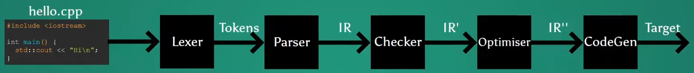
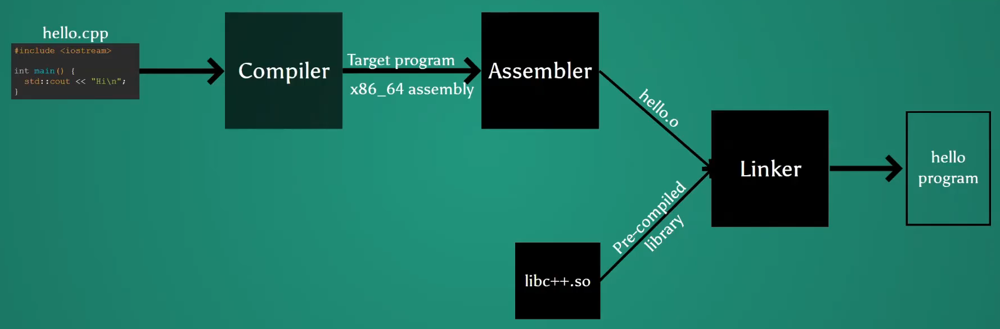

# C++ Toolchain

Here is a *very* simple c++ program, `simple.cpp`

``` cpp
int main() {}
```

Here's how we can compile it

``` sh
# with Clang (LLVM project)
clang++-11 -std=c++20 -Wall -Wextra -pedantic -Werror -o simple simple.cpp
# with GCC (GNU)
g++-11 -std=c++20 -Wall -Wextra -pedantic -Werror -o simple simple.cpp
# with MSVC (Windows only)
cl.exe /std:c++latest /W4 /Wx /EHsc /permissive- /Fo"simple.exe" simple.cpp
```

## How Compilation Works



**Source files** are programs text stored in some file. A source file with all of its headers included is called a **translation unit** (TU).

A **lexer** scans in characters from source files, groups the characters into sequences called tokens, then passes the tokens to a parser.

Example of tokens:

``` txt
token{kind::int_,   {.line=1,.col=1},  {.line=1,.col=4},  "int"}
token{kind::id_,    {.line=1,.col=5},  {.line=1,.col=9},  "main"}
token{kind::lparen, {.line=1,.col=10}, {.line=1,.col=11}, "("}
token{kind::rparen, {.line=1,.col=11}, {.line=1,.col=12}, ")"}
token{kind::lcurly, {.line=1,.col=14}, {.line=1,.col=15}, "{"}
token{kind::rcurly, {.line=1,.col=15}, {.line=1,.col=16}, "}"}
token{kind::eof,    {.line=1,.col=16}, {.line=1,.col=16}, "$"}
```

A **parser** checks to make sure that tokens are ordered according to grammar. It generates *syntax errors* for tokens out of place (e.g. `main int()`). If there are no errors, it generates an intermediate representation (e.g. directed acyclic graph) to represent "special" tokens. It gives IR to the semantics analyser (Checker)

``` txt
|translation_unit
-|declaration_seq
--|declaration
---|function_definition
-----|return_tupe:      "int" @ {1,1}..{1,4}
-----|identifier:       "main" @ {1,5}..{1..9}
-----|parameters:       none
-----|function_body
------|compound_statement:-empty
-|eof
```

The **checker** checks to make sure the semantic rules are upheld. It annotates the IR received from the parser and gives an annotated IR to the next stage.

``` txt
|translation_unit
-|declaration_seq
--|declaration
---|function_definition
-----|return_tupe:      "int" @ {1,1}..{1,4}
-----|identifier:       "main" @ {1,5}..{1..9}
-----|parameters:       none
-----|function_body
------|compound_statement
-------|return_statement
--------|primary_expression: 0
-|eof
```

The **optimiser** is an optional stage between the checker and code generator that transforms the original mapping into something equivalent, but "better". It might optimise for speed or size.

The **code generator** generates a target file equivalent to the source file (basically the source file in another language)

Example: x86_64 assembly:

``` assembly
main:               # @main
    push rbp
    mov  rbp, rsp
    xor  eax, eax
    pop  rbp
    ret
```

## How Translation Works



The **assembler** creates object files from the target files.

The **linker** joins the object files with pre-compiled library to create the final program.

The compiler's optimiser can't make optimisations *across* different objects. If you compile `first.cpp` tody, `second.cpp` tomorrow, and then link them three days from now, how can the optimiser reasonably on that?  
The linker has all the object files at the same time, so it's able to optimise across object files during linking. This is known as **link-time optimisation**

``` sh
# with Clang (LLVM project)
clang++-11 -std=c++20 -Wall -Wextra -pedantic -Werror -o simple -O3 -flto=thin [-fuse-ld=lld] simple.cpp
# with GCC (GNU)
g++-11 -std=c++20 -Wall -Wextra -pedantic -Werror -o simple -O3 -flto [-fuse-ld=gold] simple.cpp
# with MSVC (Windows only)
cl.exe /std:c++latest /W4 /Wx /EHsc /permissive- /Fo"simple.exe" /Ox /GL simple.cpp
```

## Toolchains

A **toolchain** is a set of programming tools used to build a project. For COMP6771, these are the tools part of the toolchain:

* Compiler (`clang++-11`)
* Linker (`lld-11`)
* Linter (`clang-tidy-11`)
* Package manager (`vcpkg`)
* Debugger (`lldb-11`)
* Libraries
* Standard library (`libc++-11`. `libc++abi-11`)

Shell scripts aren't enough to automate this process, because they don't understand the notion of a dependency. They'll either compile everything every time or compile exactly what you want.

A **build system** automates the process of compiling  and linking the edited parts of a program so that you don't need to worry about the process more than once.

Examples: make, ninja, Maven, Apache Ant, Cargo

Build systems are only good for a single toolchain. If we wanted to build on all three operating systems, we need to write three build scripts. If we wanted to build for all available major toolchains, we need to write build scripts per operating system, per toolchain.

CMake is a build system generator. We state what we want and let CMake work out how to write the build script.

## Setting Up a New Project

`cmake-kits.json` is a way of interacting with CMake through JSON instead of the command line.

``` json
[
    {
        "name": "COMP6771",
        "toolchainFile": "${workspaceFolder}/vcpkg/scripts/buildsystems/vcpkg.cmake",
        "preferredGenerator": {
            "name":    "Ninja"
        },
        "cmakeSettings": {
            "VCPKG_CHAINLOAD_TOOLCHAIN_FILE": "${workspaceFolder}/config/cmake/toolchains/clang-libcxx.cmake",
            "VCPKG_TARGET_TRIPLET": "x64-linux-libcxx",
            "CMAKE_C_COMPILER": "/usr/bin/clang-11",
            "CMAKE_CXX_COMPILER": "/usr/bin/clang++-11",
            "CMAKE_PREFIX_PATH": "/usr/lib/llvm-11"
        }
    }
]
```

`compile_comands.json` looks at all the rules that we have in our other `CMakeLists.txt` and gives all this information to the language server. This is how we communicate with the tools that shows our errors and formats our code.

`CMakeLists.txt` is read by CMake for it to figure out what it needs to generate for us.

``` cmake
# Copyright (c) Christopher Di Bella.
# SPDX-License-Identifier: Apache-2.0 WITH LLVM-exception

# the version of CMake we want to use
cmake_minimum_required(VERSION 3.13)

# the project name
project("COMP6771_LAB" CXX)
add_library(${PROJECT_NAME} INTERFACE)

# which C++ standards and extensions we are using
set(CMAKE_CXX_STANDARD 20)
set(CMAKE_CXX_EXTENSIONS Off)
set(CMAKE_CXX_STANDARD_REQUIRED On)
set(CMAKE_EXPORT_COMPILE_COMMANDS On)

list(APPEND CMAKE_MODULE_PATH "${CMAKE_CURRENT_SOURCE_DIR}/config/cmake")

# Project configuration
enable_testing()
include(CTest)

# clang-tidy options
option(${PROJECT_NAME}_ENABLE_CLANG_TIDY "Builds with clang-tidy, if available. Defaults to On." On)

if(${PROJECT_NAME}_ENABLE_CLANG_TIDY)
	find_package(ClangTidy REQUIRED)
endif()

include(add-targets)

find_package(absl CONFIG REQUIRED)
find_package(benchmark CONFIG REQUIRED)
# find_package(constexpr-contracts REQUIRED)
find_package(Catch2 CONFIG REQUIRED)
find_package(fmt CONFIG REQUIRED)
find_package(gsl-lite CONFIG REQUIRED)
find_package(range-v3 CONFIG REQUIRED)

# where the header files are
include_directories(include)

# where the source files are
add_subdirectory(source)
add_subdirectory(test)
```

There are multiple `CMakeLists.txt` files in a project.  
There are three different kinds of generators we can make in `CMakeLists.txt`; `cxx_library`, `cxx_executable`, `cxx_test`

``` cmake
cxx_(library|executable|test) {
    TARGET target_name
    FILENAME "source_file.cpp"
    LINK libraries_to_link
}
```

### Toolchain File

A **toolchain file** is a file that contains  all the details about your toolchain. You can tell CMake where it is by defining `CMAKE_TOOLCHAIN_FILE`. CMake then uses this toolchain file to generate all the toolchain-specific build rules.  
For COMP6771, the toolchain files are located in `config/cmake/toolchain`

E.g. `clang-libcxx.cmake`

``` cmake
include("${CMAKE_CURRENT_LIST_DIR}/gnu-flags.cmake")

set(CMAKE_CXX_COMPILER_ID Clang)
set(CMAKE_CXX_COMPILER_VERSION 11)
set(CMAKE_CXX_COMPILER "clang++-11")

# compiling flags
set(CMAKE_CXX_FLAGS "${CMAKE_CXX_FLAGS} -stdlib=libc++")
set(CMAKE_CXX_FLAGS "${CMAKE_CXX_FLAGS} -isystem /usr/lib/llvm-11/include/c++/v1")

# compiling flags exclusive to the release build
set(CMAKE_CXX_FLAGS_RELEASE "${CMAKE_CXX_FLAGS_RELEASE} -fsanitize=cfi")

set(CMAKE_EXE_LINKER_FLAGS "${CMAKE_EXE_LINKER_FLAGS} -fuse-ld=lld")

set(CMAKE_AR "llvm-ar-11")
set(CMAKE_RC_COMPILER "llvm-rc-11")
set(CMAKE_RANLIB "llvm-ranlib-11")
```

E.g. `gnu-flags.cmake`

``` cmake
# everything we need is in "/usr/"
set(CMAKE_FIND_ROOT_PATH "/usr/")
set(CMAKE_GENERATOR Ninja)
set(CMAKE_FIND_ROOT_PATH_MODE_PROGRAM NEVER)
set(CMAKE_FIND_ROOT_PATH_MODE_LIBRARY ONLY)
set(CMAKE_FIND_ROOT_PATH_MODE_INCLUDE ONLY)

set(CMAKE_INTERPROCEDURAL_OPTIMIZATION_RELEASE ON)

# where clang-tidy can be found
set(${PROJECT_NAME}_CLANG_TIDY_PATH "${CMAKE_FIND_ROOT_PATH}bin/clang-tidy-11")

# flags that are turned on for all build modes
set(CMAKE_CXX_FLAGS "${CMAKE_CXX_FLAGS} -fvisibility=hidden")

set(CMAKE_CXX_FLAGS "${CMAKE_CXX_FLAGS} -fstack-protector")
set(CMAKE_CXX_FLAGS "${CMAKE_CXX_FLAGS} -fdiagnostics-color=always")
set(CMAKE_CXX_FLAGS "${CMAKE_CXX_FLAGS} -pedantic")

set(CMAKE_CXX_FLAGS "${CMAKE_CXX_FLAGS} -Werror")
set(CMAKE_CXX_FLAGS "${CMAKE_CXX_FLAGS} -Wall")
set(CMAKE_CXX_FLAGS "${CMAKE_CXX_FLAGS} -Wextra")
set(CMAKE_CXX_FLAGS "${CMAKE_CXX_FLAGS} -Wcast-align")
set(CMAKE_CXX_FLAGS "${CMAKE_CXX_FLAGS} -Wconversion")
set(CMAKE_CXX_FLAGS "${CMAKE_CXX_FLAGS} -Wdouble-promotion")
set(CMAKE_CXX_FLAGS "${CMAKE_CXX_FLAGS} -Wnon-virtual-dtor")
set(CMAKE_CXX_FLAGS "${CMAKE_CXX_FLAGS} -Wold-style-cast")
set(CMAKE_CXX_FLAGS "${CMAKE_CXX_FLAGS} -Woverloaded-virtual")
set(CMAKE_CXX_FLAGS "${CMAKE_CXX_FLAGS} -Wshadow")
set(CMAKE_CXX_FLAGS "${CMAKE_CXX_FLAGS} -Wsign-conversion")
set(CMAKE_CXX_FLAGS "${CMAKE_CXX_FLAGS} -Wsign-promo")
set(CMAKE_CXX_FLAGS "${CMAKE_CXX_FLAGS} -Wunused")
set(CMAKE_CXX_FLAGS "${CMAKE_CXX_FLAGS} -Wformat=2")
set(CMAKE_CXX_FLAGS "${CMAKE_CXX_FLAGS} -Wodr")
set(CMAKE_CXX_FLAGS "${CMAKE_CXX_FLAGS} -Wno-attributes")
set(CMAKE_CXX_FLAGS "${CMAKE_CXX_FLAGS} -Wnull-dereference")
set(CMAKE_CXX_FLAGS "${CMAKE_CXX_FLAGS} -Wno-unused-command-line-argument")

set(CMAKE_CXX_FLAGS_DEBUG "${CMAKE_CXX_FLAGS_DEBUG} -fsanitize=address,undefined")
set(CMAKE_CXX_FLAGS_DEBUG "${CMAKE_CXX_FLAGS_DEBUG} -fstack-protector-strong")

set(CMAKE_CXX_FLAGS_RELWITHDEBINFO "${CMAKE_CXX_FLAGS_RELWITHDEBINFO} -fsanitize=address,undefined")
set(CMAKE_CXX_FLAGS_RELWITHDEBINFO "${CMAKE_CXX_FLAGS_RELWITHDEBINFO} -fstack-protector-strong")
```
